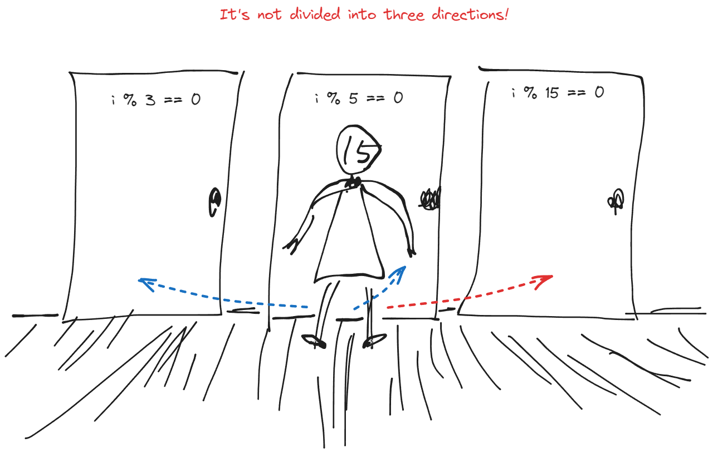

# ✍🏻 🈖️ FizzBuzz問題

## 💡 ループ処理はOKでしたか？

まずは、**1 から 30 までの数を順番に出力しましょう。**基本中の基本、`for`文を使います。

/// admonition | サンプルコード

```java title="FizzBuzzApp.java" hl_lines="2-4"
  public static void main(String[] args) {
    for (int i = 1; i <= 30; i++) {
      System.out.println(i);
    }
  }
```

///

## 💡 条件分岐はOKでしたか？

次に、**" n の倍数のとき"をプログラムで書き表せる言葉に翻訳します。**
" n の倍数のとき"を翻訳すると、" n で割り切れるとき"になります。

では、" n で割り切れるとき"をプログラム言語で書くとどうなるでしょうか？もう少し翻訳が必要ですね。
" n で割り切れるとき"をさらに翻訳すると、**①" n で割ったときの余りが 0 "** **②"だったら"**になります。

①" n で割ったときの余りが 0 "という表現は、算術演算子"`A % B`（AをBで割った余り）"と、比較演算子"`==`（一致する）"と相性が良くなりました。  
②"だったら"は`if`文を使えばいいですね。  

では、コードに書いてみましょう。

/// admonition | サンプルコード

```java title="FizzBuzzApp.java" hl_lines="3-9 11"
  public static void main(String[] args) {
    for (int i = 1; i <= 30; i++) {
      if (i % 3 == 0) {
        System.out.println("Fizz");
      } else if (i % 5 == 0) {
        System.out.println("Buzz");
      } else if (i % 15 == 0) {
        System.out.println("FizzBuzz");
      } else {
        System.out.println(i);
      }
    }
  }
```

///

## 💡 実行順序はOKでしたか？

ここまでかけたら、実際に動かして確認してみましょう。

---

15 と 30 が `FizzBuzz`にならずに、`Fizz`になってしまいます。
問題文の通りに`if`文を書くと、期待通りに動きません。
**プログラムは上から順番に処理する**ので、 15 が" 3 の倍数である"という条件に先に引っ掛かり、
`Fizz`が出力されます。なので、評価する順番を直しましょう。

<figure markdown>
  <figcaption>NO!</figcaption>
  { width="480" }
</figure>
---

完成したものがこちら。

/// admonition | サンプルコード

```java title="FizzBuzzApp.java" hl_lines="3-5"
  public static void main(String[] args) {
    for (int i = 1; i <= 30; i++) {
      if (i % 15 == 0) {
        System.out.println("FizzBuzz");
      } else if (i % 3 == 0) {
        System.out.println("Fizz");
      } else if (i % 5 == 0) {
        System.out.println("Buzz");
      } else {
        System.out.println(i);
      }
    }
  }
```

///
