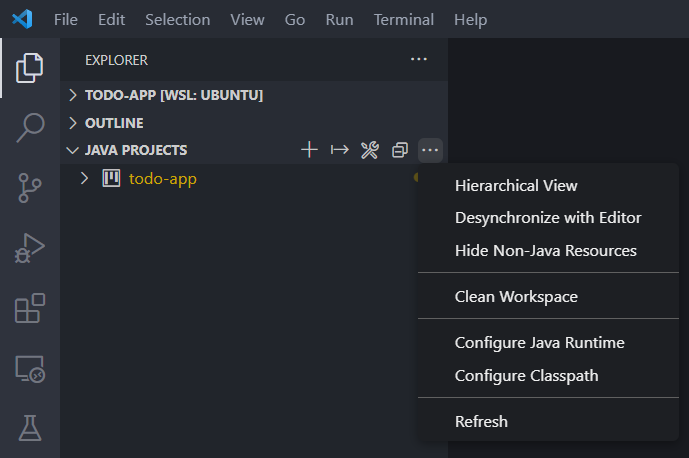

# 📖 🈖️ リーディング１

この問題で確認したかったこと

- コーディング規約を知っているか？
- 開発環境の Linter と フォーマッタ が機能するか？
- 名前の重要性を知っているか？

## 命名規約に則る

プログラミング言語には命名規約があります。
Java では、クラス名、メソッド名、変数名、定数名で命名が異なります。[^1]

[^1]: 他の言語、PythonやJavaScriptにもあります。若干ルールが異なります。

|            |                                            | 例              |     |
| ---------- | ------------------------------------------ | --------------- | --- |
| クラス名   | アッパーキャメルケース(パスカルケース)     | GameController  |     |
| メソッド名 | ローワーキャメルケース(キャメルケース)     | gameController  |     |
| 変数名     | ローワーキャメルケース(キャメルケース)     | gameController  |     |
| 定数名     | アッパースネークケース(コンスタントケース) | GAME_CONTROLLER |     |

😕 課題の例では、メソッド名、変数名、定数名すべて間違っています。

## インデントを正しくする（フォーマッタをかける）

> プログラミングの分野では、プログラムの構造を見やすくするために制御構文の内側にある行などの先頭に、一律に同じ幅の空白を挿入することです。[^2]

[^2]: [tech log](https://tech-compass.pro/contents/technology/programmingbasic-02/#:~:text=%E3%82%A4%E3%83%B3%E3%83%87%E3%83%B3%E3%83%88%E3%81%A8%E3%81%AF%E3%80%81%E6%96%87%E7%AB%A0%E3%81%AE,%E3%82%92%E6%8C%BF%E5%85%A5%E3%81%99%E3%82%8B%E3%81%93%E3%81%A8%E3%81%A7%E3%81%99%E3%80%82)

インデントはスペース2つだったり4つだったり、タブだったりします。
実際に何かは重要ではありません。整列されていることが重要です。

😕 課題の例では、for文のインデントと、メソッドの閉じかっこがずれています。

---

命名規約とインデントは設定が入っていれば開発環境が警告を出してくれます。
これを`Linter`といいます。
また、インデントも整列してくれます。これを`Formatter`といいます。

ためしに、開発環境で適当にクラスを作って課題文を張り付けてみてください。
黄色い波線で何か言われないでしょうか？
また、保存すると勝手にインデントを整形してくれないでしょうか？

そうでないなら、いったんクリーンアップ(Clean Workspace)しましょう。

{ width="480" }

---

## 名前で意味を示す

まず、定数名に`ZERO`と`ONE`をつけています。

```java
  static final int zero = 0;
  static final int one = 1;
```

これは、**値を示している**だけです。
**意味を示しましょう**。

`0`が負けなら、`DEFEAT`  
`1`が負けなら、`VICTORY`  
ですね。

次です。

```java
    int a = 0; // 勝ちの数
    int b = 0; // 負けの数
```

勝ちの数、負けの数も意味を示せばコメントが不要になります。

```java
    int victoryCount = 0;
    int defeatCount = 0;
```

😕 課題の例では、名前に意味がありません。

## 意味のあるコメントを書く

```java
  // 引数の VictoryOrDefeat の数だけループする
  for (int i = 0; i < VictoryOrDefeat.length; i++) {
```

これでは`for文`の説明になっているので意味がありません。
また、ループする回数は、正しくは VictoryOrDefeat の**要素数**です。
このメソッドの引数は１つしかありません。

```java
        a = a + 1; // 勝ちの数に１加算する
```

こちらも、足し算の説明になっています。

```java
  public static void COUNT_VICTORY_OR_DEFEAT(int[] VictoryOrDefeat) {
```

簡単な処理なので、意味のある名前を付けていればコメントは不要でしょう。
あえてつけるとするなら、メソッドの説明として、`カウントしてさらに出力までする`ということも書いたほうが親切でしょう。

😕 課題の例では、意味のあるコメントは一つもありません。

## コードに秩序を持たせる

そんな誤りだらけのコードですが、バグではありません。
明確な不具合は１つです。

```java
  static final int zero = 0;
  static final int one = 1;
```

定数の並び順は、`0`が負け、`1`が勝ちです。つまり、上が負け、下が勝ちです。
0,1,...と数の大小順に並べたのでしょう。

```java
    int a = 0; // 勝ちの数
    int b = 0; // 負けの数
```

変数宣言の時点では、上を勝ち、下に負けにしてしまっています。
言葉の順番`勝ち負け`にしたのでしょうか？

```java
    if (VictoryOrDefeat[i] == zero) {
        a = a + 1; // 勝ちの数に１加算する
      } else if (VictoryOrDefeat[i] == one) {
        b = b + 1; // 負けの数に１加算する
    }
```

その結果、`0(負け)`なら勝ちに加算、`1(勝ち)`なら負けに加算しています。

名前で意味を示すのが大前提ですが、
上が負け、下が勝ちのまま変数宣言をしていたら防げたかもしれません。

/// admonition | これを書いて気になったこと
今までも、コード => 解説 の順番で書いてたっけ？
解説 => コード の順番で書いてなかったっけ？
///

😕 課題の例では、順番が入れ替わっていて頭が混乱します。

## まとめ

すべてコードを書く上で基礎となる観点です。

- 命名規約に則る
- インデントを正しくする（フォーマッタをかける）
- 名前で意味を示す
- 意味のあるコメントを書く
- コードに秩序を持たせる
