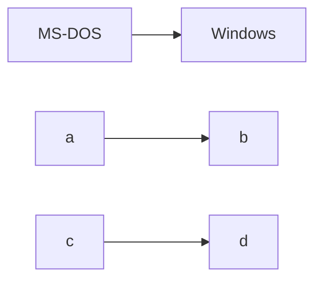

# 🧑‍💻 開発環境を作ろう

## WSL(Linux 用 Windows サブシステム)

[WSL を使用して Windows に Linux をインストールする](https://learn.microsoft.com/ja-jp/windows/wsl/install)

1\. コマンドを実行する

```sh title="PowerShell(管理者モード)"
wsl --install
```

/// admonition

```sh title="🖨️ 出力結果"
 インストール中: 仮想マシン プラットフォーム
 仮想マシン プラットフォーム はインストールされました。
 インストール中: Linux 用 Windows サブシステム
 Linux 用 Windows サブシステム  はインストールされました。
 インストール中: Linux 用 Windows サブシステム
 Linux 用 Windows サブシステム  はインストールされました。
 インストール中: Ubuntu
 Ubuntu はインストールされました。
 要求された操作は正常に終了しました。変更を有効にするには、システムを再起動する必要があります。
```

///

2\. メッセージが出力されたら 再起動する

3\. **再起動したら自動で Ubuntu のウィンドウが開くのでしばらく操作をしない(2~3分)**

4\. Ubuntu のウィンドウが開いたら自動で処理が始まるのでしばらく待つ

/// admonition

```sh
 Ubuntu は既にインストールされています。
 Ubuntu を起動しています...
 Installing, this may take a few minutes...
```

///

5\. Linux のユーザ名を聞かれるので **Windows のユーザ名と同じ名前を入力する**

```sh
 Please create a default UNIX user account. The username does not need to match your Windows username.
 For more information visit: https://aka.ms/wslusers
 Enter new UNIX username: # **ここでWindows のユーザ名と同じ名前を入力してください**
 New password: # パスワードは簡単なものでいい
 Retype new password:
 passwd: password updated successfully
 Installation successful!
```

/// admonition | Windows のユーザ名の確認方法

```sh title="PowerShell"
echo $Env:USERNAME
```

```sh title="コマンド プロンプト"
echo %USERNAME%
```

///

### WSLって何？

[Linux 用 Windows サブシステムとは](https://learn.microsoft.com/ja-jp/windows/wsl/about)

簡単に書くと、`Windows` 上で `Linux` が動かせるよ、ということ。

### Linux って何？

OSの一種。Windows や Mac と同列の存在。

/// admonition | OS の歴史



///

### OS の上で OS が動くって何？

[WSL2の構成](https://qiita.com/na-777/items/7ead86b723c683346eba#wsl2%E3%81%AE%E6%A7%8B%E6%88%90)

深く理解する必要はありません。

大切なことはどうつながっているか？です。

- Windows から Linux を見るには？
  - どうやってつながっている？
    - **ネットワーク**
  - ネットワーク？
    - ファイルエクスプローラーから、 `\\wsl$\` または `\\wsl.localhost\` が `Windows` <=> `Linux` をつなぐネットワーク
- Linux から Windows を見る
  - どうやってつながっている？
    - **マウント**
  - マウント？
    - イメージ、Windows に USB を差し込むと USBの中身が見られるよね。
    - それと同じ。Linux のPCに Windows のUSBがぶっ刺さっている状態。
  - どうやってみる？
    - Linux からみた `/c/`ディレクトリが Windows の`C:\`ディレクトリ

### なんで Windows 上で Linux を動かすの？

1. 本番環境で、ウェブアプリが動く場所（＝ウェブサーバ）の OS が Linux だから
   - OS 差分は結構ある。本番環境で実行してみたら挙動が変わっちゃう、ということが防げる
2. 各種ツールを Windows に直にインストールすると、環境の変更が難しいから
   - Linux なら Docker をそのまま動かせる
     - 例えば案件Ａでは v1.0.0 を使わないといけないけど、案件Ｂでは v2.0.0 使うんだよね
     - Docker なら、別バージョンを共存できる
   - Linux なら パッケージ管理ツールも充実している
     - Docker と同様に環境汚染が防げる
3. Linux なら環境を作り直すのが楽
   - Windows をリセットして再設定する場合、ネットワークの設定、ユーザ作成、･･･すべて画面から操作する必要があるので再生に時間がかかる
   - Linux ならコマンドを用意しておけば一発でできる（時間はかかるけど操作は少ない）

### Ubuntu って何？ Linux じゃないの？

Linux の子孫みたいなものだ。
子孫はいっぱいいる。

[Linuxディストリビューション](https://ja.wikipedia.org/wiki/Linux%E3%83%87%E3%82%A3%E3%82%B9%E3%83%88%E3%83%AA%E3%83%93%E3%83%A5%E3%83%BC%E3%82%B7%E3%83%A7%E3%83%B3)

## WSL がインストールできたら Ubuntu に dotfiles を入れる

1\. 上から順番にコマンドを実行する

```bash title="Ubuntu"
sudo apt-get update && sudo apt-get upgrade
sudo apt-get install -y lsb-release build-essential curl file git procps curl git vim wget zsh
sudo apt-get install -y build-essential curl libbz2-dev libffi-dev liblzma-dev libncursesw5-dev libreadline-dev libsqlite3-dev libssl-dev libxml2-dev libxmlsec1-dev llvm make tk-dev wget xz-utils zlib1g-dev
curl -fsSL https://raw.githubusercontent.com/oktntko/dotfiles/main/install.zsh | zsh
# 最後までいくとたしかパスワードを聞かれるので、パスワードを入力する
```

2\. "Ubuntu" のウィンドウを閉じる

3\. Windows Terminal を開き、Ubuntuタブを開く

4\. 設定＞スタートアップ＞既定のプロファイル で "Ubuntu" を選ぶ

5\. 設定＞規定値＞外観＞フォントフェイス で NerdFont に対応したフォントを選ぶ

### dotfiles ってなに？

Windows と違い、Linux には隠しファイル・隠しフォルダという属性がない。
かわりに、`.(ドット)`で始まるファイルを隠しファイル・隠しフォルダとして扱う。

Windows における隠しファイル・隠しフォルダはアプリのデータや設定など、
Windows に保存せざるを得ないがユーザが直接見る必要のないデータだ。

ここでいう dotfiles はアプリの設定をまとめたもの。
アプリって何かというと、 Linux で使う開発ツール類。
開発ツールの設定を共有したのだ。

### ツールの使い方がわからない

[oktntko/dotfiles](https://github.com/oktntko/dotfiles)にまとめているけど、
詳細は各ツールのREADMEを読んでくれ。

## Ubuntu に dotfiles が入ったら Ubuntu に Docker を入れる

1\. [Install using the apt repository](https://docs.docker.com/engine/install/ubuntu/#install-using-the-repository)の章で次の二つを実施する

- Set up the repository
- Install Docker Engine

2\. `sudo usermod -aG docker $USER`

TODO

### Docker って何？

TODO

## 作成済みのリポジトリをクローンしてサンプルプロジェクトを動かす

TODO
