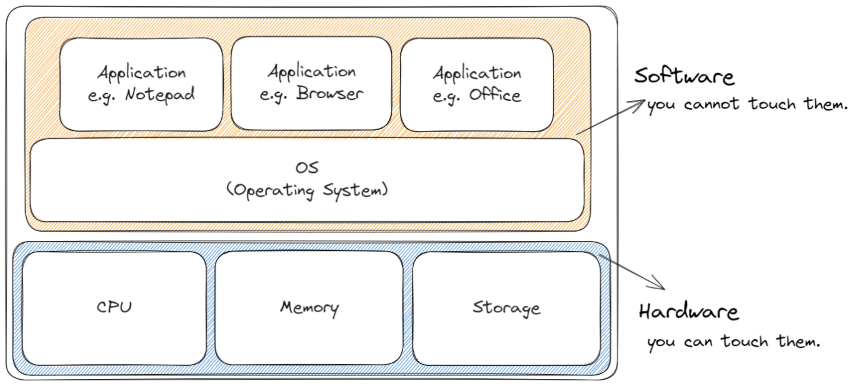

# とにかく動かしてみよう

とにかく動かしてみましょう。動かした分だけレベルアップできます。

システムを動かすのに必要なのはハードとソフトです。

ここではハードとソフトをそろえて"Hello World"するまでのレッスンをします。

/// admonition | ハードウェア と ソフトウェア

- ハードウェアは触れられる部分、つまり"もの"です。
- ソフトウェアは触れられない部分にあり、中で動くものです。

///

/// admonition | OS(Operating System)
OSは例えばWindowsやMac、Linuxといったものです。  
ソフトウェアの中でも特別な地位にいて、ハードとソフトの仲立ち役をします。  
///
