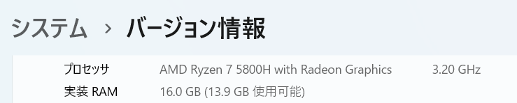

# いいパソコンを使おう

**プロのエンジニアとして、いいパソコンを使いましょう。**
学生時代に使っていた低スペックのパソコンは今すぐ正規の方法で処分しましょう。  

え？低スペックじゃない？そもそもスペックが何かわからない？

{ width="120" }

では最初にスペックを確認しましょう。

## スペックの確認方法

「開発に適した」といえるかどうかは、少なくとも次の３つのスペックを確認します。

|      | ハード     | お仕事                                                         |
| ---: | ---------- | -------------------------------------------------------------- |
|    1 | CPU        | パソコンの頭脳。スペックが高い＝頭の回転が速い                 |
|    2 | メモリ     | パソコンの作業場所。スペックが高い＝同時に処理できる量が多い   |
|    3 | ストレージ | パソコンの引き出し。スペックが高い＝収納できるデータの量が多い |

/// admonition
以下、すべて Windows 11 のキャプチャ
///

### 🏽 CPU の確認方法

++windows+i++ 設定＞システム＞バージョン情報  
プロセッサ＞この画像では`AMD Ryzen 7 5800H`

<figure markdown>
  { width="480" }
</figure>

CPUのスペック＝ベンチマーク＝戦闘力です。

ノートPCの場合は[CPU性能比較表（ノートパソコン・タブレットPC）【2023年最新版】](https://pcfreebook.com/article/458775622.html)から、
デスクトップの場合は[CPU性能比較表【2023年最新版】](https://pcfreebook.com/article/450856544.html)から、
ベンチマークを「PassMark」にして探してみましょう。ないってことはないと思います。

/// admonition | ブラウザの使い方
++ctrl+f++ で検索ボックスを開いてCPU名を入力しましょう。  
AMDとかIntelとかを消して検索しましょう。
///

/// admonition | [わかりやすい！CPUの表記の見方](https://student-notepc.com/cpu_how.html)
CPUの名前だけでスペックがいいか悪いかある程度分かります。数字が大きいほどいい！
こちらのサイトでわかりやすく解説されているので、「 CPU なんてはじめて聞いたわ！」って人は見ておくことをおすすめします。
///

/// admonition | AMD と Intel
詳しく説明されているサイトがあるので調べてみましょう。
///

### 📟 メモリの確認方法

++windows+i++ 設定＞システム＞バージョン情報  
実装RAM＞この画像では`16.0 GB`

<figure markdown>
  { width="480" }
</figure>

### 💾 ストレージの確認方法

ストレージは 容量 と、SSD か HDD かが重要です。

- 容量
  1. ++windows+e++ で エクスプローラーを開く
  2. 「PC」をクリック
     - 出ている数値が容量
- SSD か HDD か
  1. ++windows+r++ で ファイル名を指定して実行画面を開く
  2. 「dfrgui.exe」を入力してOK
     - メディアの種類が
       - ソリッドステートドライブ => SSD
       - ハードディスクドライブ => HDD

/// admonition | HDD と SSD
詳しく説明されているサイトがあるので調べてみましょう。
///

## いいパソコンのスペック

中途半端なものを使っても理想の環境は作れません。
次の基準を満たしていなかった場合、残念ですが今使っているパソコンとはおさらばです。

- CPU: **Passmark 20,000** 以上
- メモリ: **最低8GB** 以上、**推奨16GB** 以上
- ストレージ: **SSD**で、容量は**最低256GB以上**、**推奨512GB以上** 以上

今使っているパソコンを処分する決意ができたところで、パソコンを買いましょう。

## パソコンを買います

これからあなたはパソコン（キーボード？）と触れる時間の方が、人と触れる時間より長くなります。
**パソコンをあなたのパートナー以上の存在として認めることからすべて始まります。**
つまり、パソコン選び＝パートナー選びです。パソコンのことをちゃんと知ってあげましょう。[^1]

[^1]: パソコンは３年でガタが来るので気軽に選んでいいです。

素敵なパソコンが見つかったらいざ購入しましょう。[^2]
どこで買ったほうがいい、どのメーカーがいいなどはアドバイスできませんが、
未知の情報を集めて整理するのもエンジニアの仕事のうちです。
今できる最善の選択をしましょう。

---

いきなりたいへんな出費かもしれません。
まずは、自分に投資をしたことは素直にほめましょう。
ただし、その投資を無駄にするかどうかは自分次第です。
これからパートナーに見合ったエンジニアに成長できるようこの世界に踏み込みましょう。

[^2]: このリポジトリの Windows 向けに説明を書いています。Mac を選んだ場合は少しずれるかもしれません。
