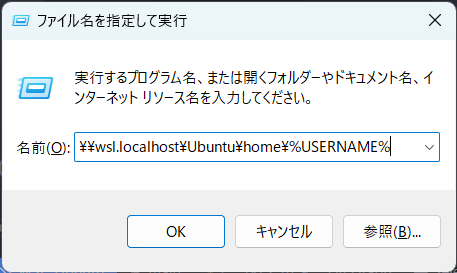
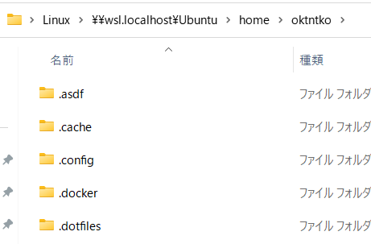
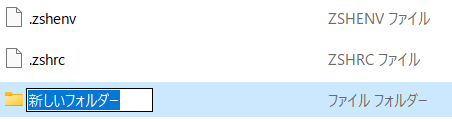
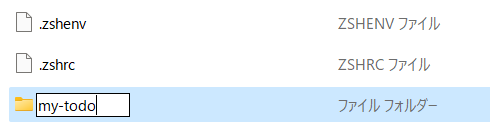
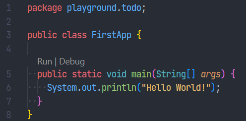
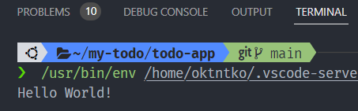
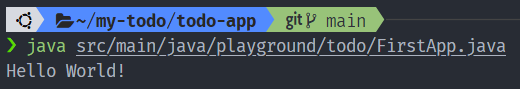

# ▶️ プロジェクトを作ろう

## 📁 プロジェクトのディレクトリを作ろう

```bash title="Windows Terminal"
❯ cd ~ # ホームディレクトリに移動する.
❯ mkdir my-todo # プロジェクトディレクトを作る.
❯ ls --long # 作ったディレクトリを確認する.
drwxr-xr-x - username xx XXX 00:00 my-todo
```

/// admonition | コマンド解説
ホームディレクトリは Windows でいう`C:\Users\%USERNAME%`にあたる.  
`cd` = `change directory`. ディレクトリを移動する. `~(チルダ)` = ホームディレクトリの別名.  
`mkdir` = `make directory`. ディレクトリを作成する.  
`ls` = `list segments`. ファイルやディレクトリの一覧を表示する.  
///

コマンドで実行した操作を画面からも実行してみましょう。

- ++windows+r++ から `\\wsl.localhost\Ubuntu\home\%USERNAME%` を入力する.
  - { width="240" }
  - { width="240" }
- ++ctrl+shift+n++ でフォルダを作成し フォルダ名に`my-todo`を入力する.
  - { width="320" }
  - { width="320" }
- 画面を確認する.

開発の現場ではコマンドの操作で行うことが多くあります。
なぜでしょうか？  

- **コマンドライン**で操作してもらおうとすると...
  - 複雑な操作でも**テキストだけで手順を書ける**。
  - **操作の履歴が残る**ので、ミスがあったときに原因がわかりやすい。
- **画面から**操作してもらおうとすると...
  - 複雑な操作になると画像なども駆使しないと手順が書けない。
  - 操作の履歴が残らないので、画面キャプチャを取りながら進める必要がある。キャプチャを取らないとミスった原因が追えない。

そのため、コマンドラインでの操作に慣れる必要があります。
最初のうちは、画面から操作するとこう、それをコマンドで操作するには？
というように、画面とコマンドでの操作を往復してリンクさせるといいかもしれません。

/// admonition | CUI と GUI
ショートカットキー然り、コマンドラインから操作できるとキーボードだけでパソコンを操作できるので作業効率は上がります。
しかし、エンジニアはコマンドラインだけ使って仕事をするわけではありません。CUI と GUIは使い分けです。
画面から操作することも多いので、`\\wsl.localhost\Ubuntu\home\%USERNAME%` はクイックアクセスに追加しておこう。
///

## ⚡ プロジェクトのディレクトリの Git を初期化しよう

Git の操作に触れるのはここだけです。コミットをしたりブランチを切ったりは適当なタイミングで実施してください。

```bash title="Windows Terminal"
❯ cd ~/my-todo # 作成した`my-todo`ディレクトリに移動する
❯ git init
❯ git config --local user.name "あなたの名前" && git config --local user.email "あなたのメールアドレス"
❯ # 例）git config --local user.name "oktntko" && git config --local user.email "oktntko@gmail.com"
❯ git commit --allow-empty --message="first commit"
```

## 📃 プロジェクトのソースコードを持ってこよう

TODO

/// admonition | 不要なファイルを削除しよう

WSLにダウンロードするとファイル名に"Zone.Identifier"とついたファイルが生まれることに気づくかもしれません。
理屈はなんかあるらしいですがいらないので消しましょう。

```bash title="Windows Terminal"
❯ cd ~/my-todo # 作成した`my-todo`ディレクトリに移動する
❯ rm --recursive --force */**/.*Zone.Identifier # `no matches found` と出ても問題ない
❯ rm --recursive --force */**/*Zone.Identifier
❯ git add .
❯ git commit -m "Download todo-app"
```

///

## 👋 Hello World をしよう

とにかく動かしてみようという割に前置きが長かったですが、さっそく動かしてみましょう。

### VSCode の拡張機能でプログラムを実行する方法

```bash title="Windows Terminal"
❯ cd ~/my-todo/todo-app # ダウンロードした`todo-app`ディレクトリに移動する
❯ code . # 現在いるディレクトリ(`~/my-todo/todo-app`)をルートディレクトリとして VSCode を起動する
```

1. VSCodeで `src/main/java/playground/todo/FirstApp.java` を開く.
2. `public static void main(String[] args) {` の上に表示されている `Run | Debug` から、`Run` をクリックする.
   - { width="320" }
3. `TERMINAL`タブに`Hello World!`が表示される
   - { width="320" }

### コンソールからプログラムを実行する方法

```bash title="Windows Terminal"
❯ cd ~/my-todo/todo-app # ダウンロードした`todo-app`ディレクトリに移動する
❯ java src/main/java/playground/todo/FirstApp.java # プログラムを実行する
Hello World!
```

{ width="320" }

これで準備は完了です！
