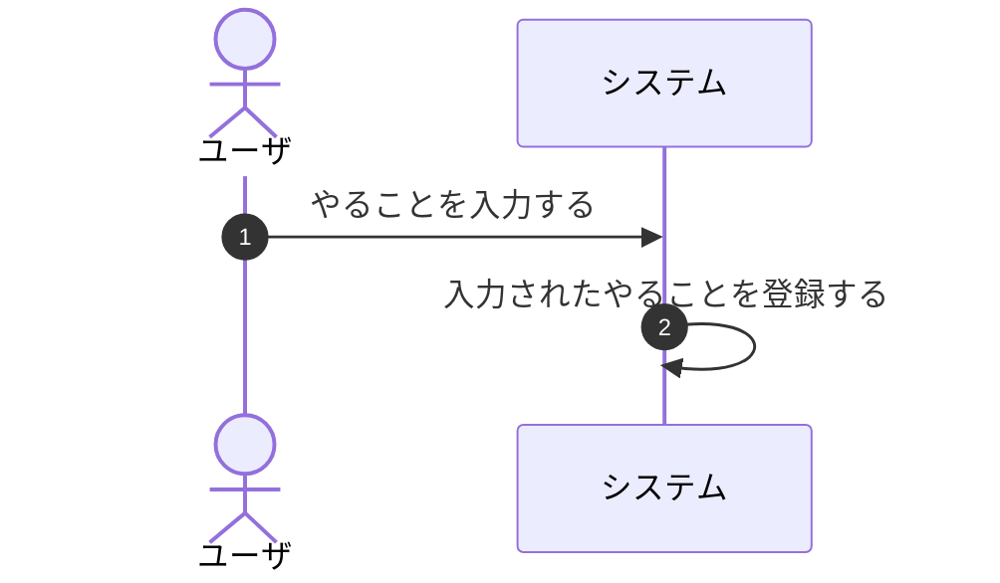
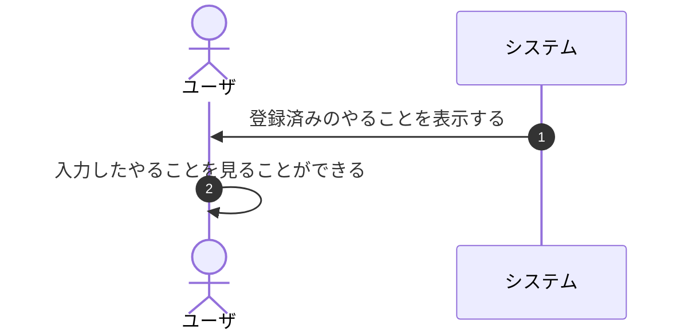
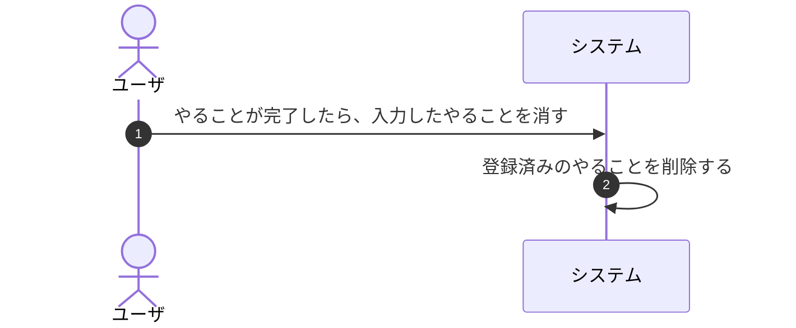
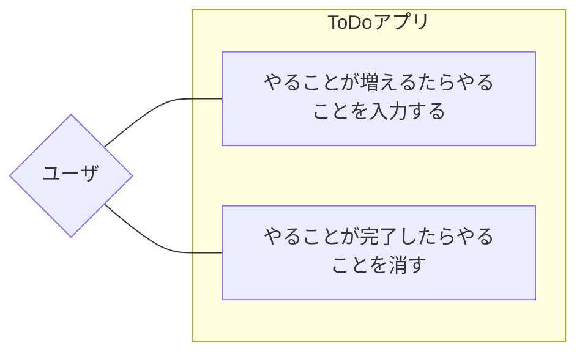
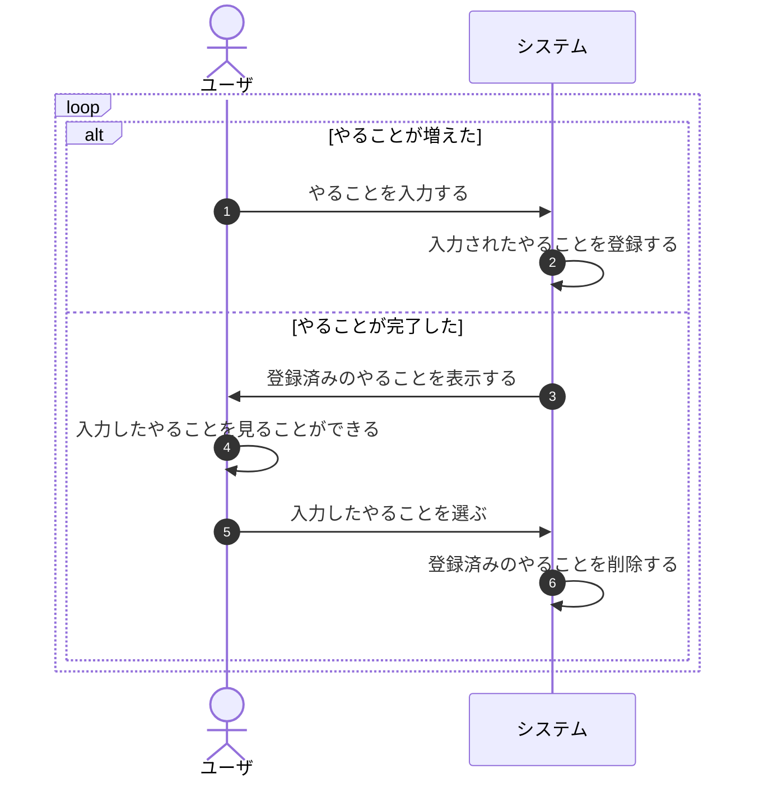
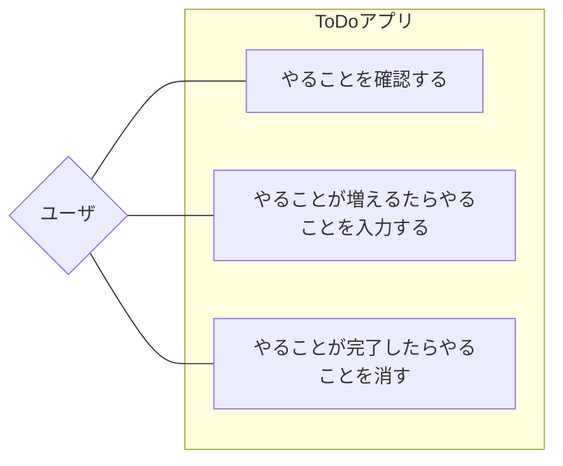
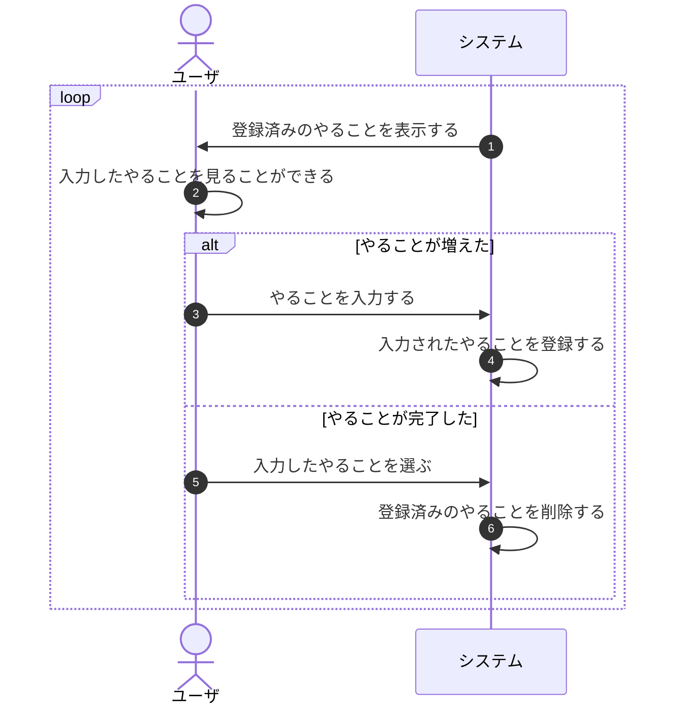

# アプリの基礎の解説

できましたか？

## やることを登録する機能を実装する



- ユーザはやることを入力する
- システムは入力されたやることを登録する

ここから始めましょう。

- ユーザはやることを入力する

これは `MyPrompt#input` を使えばいいですね。

- システムは入力されたやることを登録する

どこに登録しますか？Listに保存しておきましょう。

/// admonition | サンプルコード

```java title="FirstApp.java" hl_lines="6 9-10"
  public static void main(String[] args) throws IOException {
    AnsiConsole.systemInstall();

    System.out.println("📝 Welcome Back, My To-Do!");

    List<String> todoList = new ArrayList<>();

    for (;;) {
      String todo = MyPrompt.input("やることを入力してください >");
      todoList.add(todo);

      System.out.println("\"Ctrl + C\"で停止してください。");
    }
  }
```

///

簡単でした。`It's so easy.🎉`

## やることを表示する機能を実装する



- 登録済みのやることを表示する
- 入力したやることを見ることができる

`todoList`を`System.out`にぶち込むだけです。

/// admonition | サンプルコード

```diff
-      System.out.println("\"Ctrl + C\"で停止してください。");
+      System.out.println(todoList);
```

///

## やることを削除する機能を実装する



- やることが完了したら、入力したやることを消す
- 登録済みのやることを削除する

完了するには、ユーザが、入力したやることを選択できればいいんですが、
どうやって選択させればいいでしょうか？

`MyPrompt#select`がちょうどよさそうです。[^1]

[^1]: /// admonition | やり方は一つではない
    `MyPrompt`がなくても、やることを出力するときに番号も一緒に出力して、
    番号をユーザに入力してもらう方法もあります。
    重要なのは、やり方は一つではないということです。

    ```bash
    1: 課題を提出する
    2: 家賃を支払う
    3: １か月１万円で過ごす
    ? 完了したやることの番号を入力してください(1-3)
    ```

    ///

/// admonition | サンプルコード

```java title="FirstApp.java" hl_lines="6 14-15"
  public static void main(String[] args) throws IOException {
    AnsiConsole.systemInstall();

    System.out.println("📝 Welcome Back, My To-Do!");

    List<String> todoList = new ArrayList<>();

    for (;;) {
      String todo = MyPrompt.input("やることを入力してください >");
      todoList.add(todo);

      System.out.println(todoList);

      int index = MyPrompt.select("完了したやることを選択してください", todoList);
      todoList.remove(index);
    }
  }
```

```bash title="🖨️ 出力結果"
❯ java @/tmp/cp_7dfchp54jh4vsuotteb7aekcd.argfile playground.todo.FirstApp      
📝 Welcome Back, My To-Do!
? やることを入力してください > 課題を提出する
[課題を提出する]
? 完了したやることを選択してください 課題を提出する
? やることを入力してください > 家賃を支払う
[家賃を支払う]
? 完了したやることを選択してください 家賃を支払う
? やることを入力してください > １か月１万円で過ごす
[１か月１万円で過ごす]
? 完了したやることを選択してください
❯ １か月１万円で過ごす
```

///

**やることが一向に増えないToDoアプリの完成です。**
理想的な状態とも言えますが、システムとしては使いものになりません。

なぜでしょうか？
難しくないありません。ただ、きちんと説明はできないのではないでしょうか？

詳しく解説をします。

今の状態で実現できているのは、やることＡに対する一連の動きだけです。

1. やることＡが増える
2. やることＡが完了する

順番は必ず①増える➡②完了するになります。
これ自体はプログラムの実行順序とあっています。

**しかし現実には、やることＡが完了するまでの間に、やることＢやＣが増えます。**
ＢやＣが増える間にやることＡが完了することもあります。

1. やることＡが増える
2. やることＢが増える
3. やることＡが完了する
4. やることＣが増える
5. やることＢが完了する
6. やることＣが完了する

やることＡだけを見れば、増える➡完了するの流れはシーケンシャル（一連の動き）です。
しかし、「やること」全体を考えると、必ずしも増える➡完了するとはなりません。
増える➡増える➡完了する➡・・・かもしれないのです。

ユーザがToDoアプリを利用する場面（＝**ユースケース**といいます）が複数ある場合、
システム側からすると、なんでこのアプリが使われたのか？が分かりません。

ユースケースを整理するための図がUMLにあります。これをユースケース図といいます。



ではどうすればいいか？やることが増えたのか完了したのか、  
**最初にユーザがアクションを選べるようにしましょう。**

シーケンス図に条件分岐を加えましょう。



シーケンス図の解説

これをコードに書いていきましょう。

## アクションを選択してもらう

アクションを選択してもらうために、 `if文`を追加しましょう。

/// admonition | サンプルコード

```java title="FirstApp.java" hl_lines="2-5 8 11"
    for (;;) {
      final int INDEX_増えた = 0;
      final int INDEX_完了した = 1;

      if (MyPrompt.select("やることが増えましたか？やることが完了しましたか？",
          List.of("増えた", "完了した")) == INDEX_増えた) {
        String todo = MyPrompt.input("やることを入力してください >");
        todoList.add(todo);

      } else {
        int index = MyPrompt.select("完了したやることを選択してください", todoList);
        todoList.remove(index);
      }
    }
```

```bash title="🖨️ 出力結果"
❯ java @/tmp/cp_7dfchp54jh4vsuotteb7aekcd.argfile playground.todo.FirstApp
📝 Welcome Back, My To-Do!
? やることが増えましたか？やることが完了しましたか？ 増えた
? やることを入力してください > やることＡ
? やることが増えましたか？やることが完了しましたか？ 増えた
? やることを入力してください > やることＢ
? やることが増えましたか？やることが完了しましたか？ 完了した
? 完了したやることを選択してください やることＡ
? やることが増えましたか？やることが完了しましたか？ 増えた
? やることを入力してください > やることＣ
? やることが増えましたか？やることが完了しましたか？ 完了した
? 完了したやることを選択してください やることＢ
? やることが増えましたか？やることが完了しましたか？ 完了した
? 完了したやることを選択してください やることＣ
```

///

これで完成です！

<p style="font-size: 24px; text-align: center; font-weight: bold;">ちょっと待ってください！</p>

<figure markdown>
  <figcaption>まだあわてるような時間じゃない</figcaption>
  { width="480" }
</figure>

やることが増えたときかやることが完了したときだけ、このアプリを使うのでしょうか？
アプリとは関係なく、そもそも「やることリスト」を作る意味はなんでしょうか？

## オブジェクトを選択してもらう

> よし、今日やることはなんだったっけ？

**ただやることを確認する**という使い方もありますね。

ユースケース図に追加しましょう。



シーケンス図では、やることを表示するタイミングを前に持ってきました。



最初にやることが見えるようになりました。
強引に持ってきましたが、OOUIといいます。
[マンガでわかるOOUIの利点](https://www.concentinc.jp/design_research/2021/07/ooui/)

ウェブの世界には画面（ページ）があります。
一般にトップページ➡一覧ページ➡詳細ページと遷移します。

やや強引に一覧ページを最初にもって来たのはそのためです。

/// admonition | サンプルコード

```java title="FirstApp.java" hl_lines="3 6-13 17-18"
    List<String> todoList = new ArrayList<>();

    final String MENU_ADD = "➕ やることが増えた";

    for (;;) {
      List<String> menu = new ArrayList<>();
      menu.addAll(todoList);
      menu.add(MENU_ADD);

      int index = MyPrompt.select("あなたのやることリスト", menu);
      var todo = menu.get(index);

      if (todo == MENU_ADD) {
        String newToDo = MyPrompt.input("やることを入力してください >");
        todoList.add(newToDo);

      } else if (MyPrompt.confirm("「" + todo + "」は完了しましたか？",
          ConfirmChoice.ConfirmationValue.YES) == ConfirmChoice.ConfirmationValue.YES) {
        todoList.remove(index);
      }
    }
```

```bash title="🖨️ 出力結果"
❯ java @/tmp/cp_7dfchp54jh4vsuotteb7aekcd.argfile playground.todo.FirstApp
📝 Welcome Back, My To-Do!
? あなたのやることリスト。 完了したやることを選んでください。 ➕ やることを追加する
? やることを入力してください > 課題を提出する
? あなたのやることリスト。 完了したやることを選んでください。 ➕ やることを追加する
? やることを入力してください > 家賃を支払う
? あなたのやることリスト。 完了したやることを選んでください。 課題を提出する
? 「課題を提出する」は完了しましたか？ yes
? あなたのやることリスト。 完了したやることを選んでください。 ➕ やることを追加する
? やることを入力してください > １か月１万円で過ごす
? あなたのやることリスト。 完了したやることを選んでください。
❯ 家賃を支払う
  １か月１万円で過ごす
  ➕ やることを追加する
```

///

<p style="font-size: 24px; text-align: center; font-weight: bold;">やっと完成！🎉</p>
