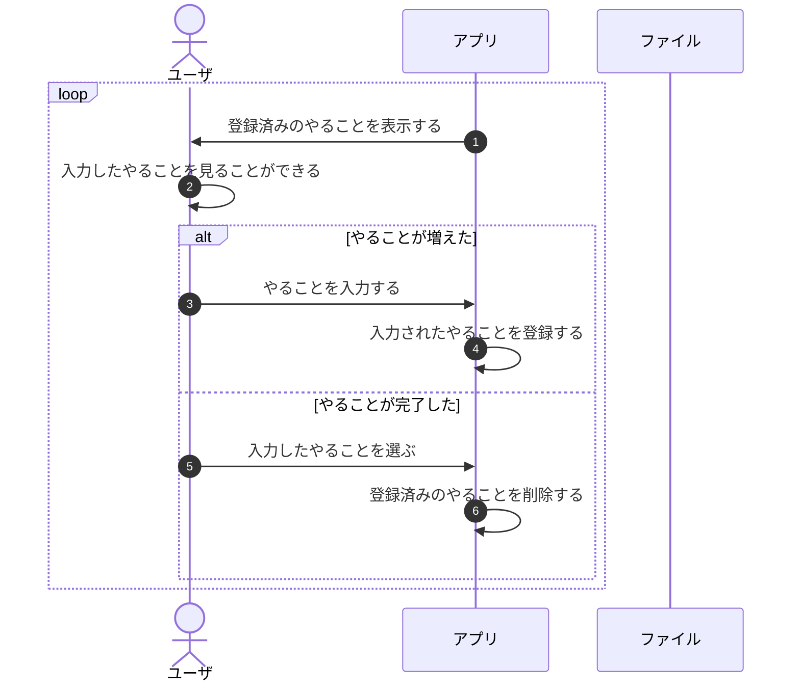

# ファイルを使おう

アプリを起動しなおすとやることが消えてしまいます。
紙の方がマシです。それではこのToDoアプリは使いものになりません。

プログラム上のListオブジェクトですね。
Java が動く環境のメモリに保存されています。
パソコンのメモリは揮発性です。電源を落とすとデータが消えてしまいます。
同様に、Java のメモリもアプリを停止するとデータが消えてしまいます。

なので、アプリの外部に保存する必要があります。
パソコンにはメモリ（作業スペース）とストレージ（引き出し）がありました。

ここで、ファイルの登場です。
ファイルはアプリにとってのストレージ代わりになります。
ファイルにデータを保存するのは普通ですね。

ここでは、ファイルを使ってデータを保存することがゴールです。

## ゴールと道筋の整理

いきなりコードを書き始めてはいけません。
ゴールとゴールまでの道筋を整理するのが先です。

"システム"を少し分解すると、

1. UIの提供(`MyPrompt.java`)
2. 処理のコントロール(ループ、条件分岐、入力されたデータを保存したり、登録済みのデータから出力したり)
3. データの管理(`List<String> todoList`)

の３つの役割がありました。

今回のゴールは、やることが消えないようにするために、ファイルに"3. データの管理"をやってもらうことです。

ファイルが登場したので、シーケンス図に新しい仲間"ファイル"を加えましょう。
そして、"システム"という名前から"アプリ"という名前にしましょう。

/// admonition | "アプリ"と"ファイル"を合わせて"システム"という意味で。
///

では、どうすればデータの管理をファイルに任せることができるでしょうか？
