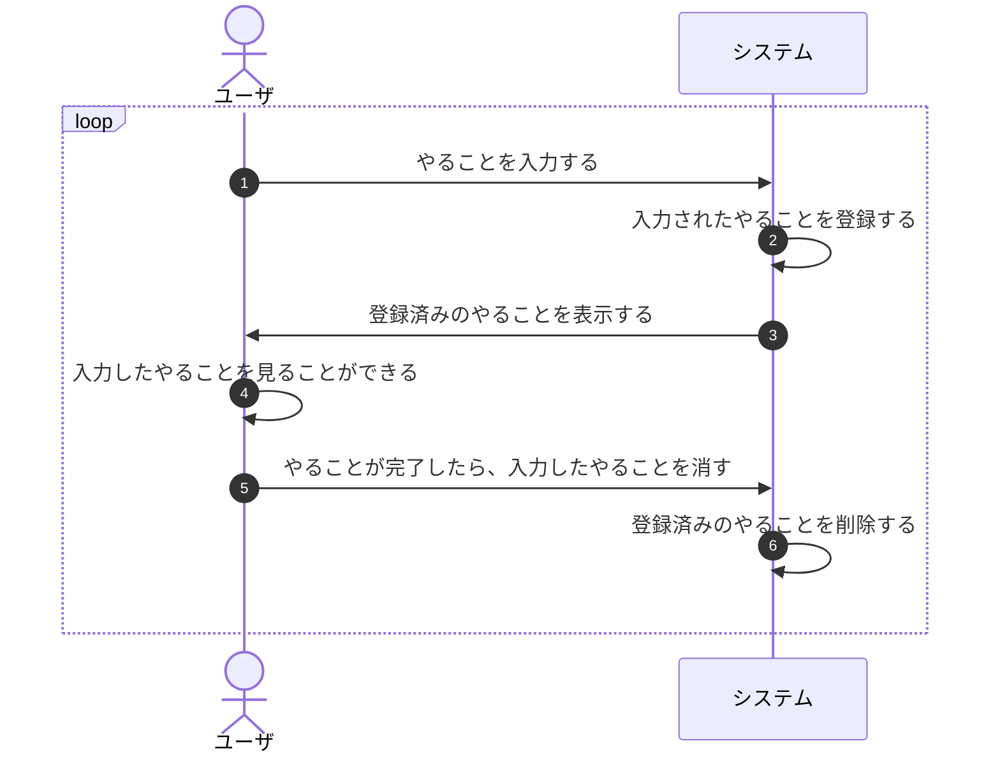

# アプリの基礎を作ろう

コンソールで動くToDoアプリを作っていきましょう。

と言われていきなり作れるでしょうか？

今まで得た経験を総動員して、まずはゴールまでの道筋を立てましょう。

---

難しかったと思います。
ToDoアプリとは何か？どういう動きをするか？が定義（言語化）されていないからです。
つまり、ゴールがわからないのに、そこに至る道筋が考えられるわけがないのです。

まずは、ToDoアプリとは何か？どういう動きをするか？を定義するところから始めましょう。

---

もしまた、いきなり言語化からはじめていたら、あなたはあほです。
**定義すること（＝言語化）がゴールなのに、言語化という手段を用いてゴールを目指しています。**
いきなり言語化できるなら言語化は既にゴールではないのです。
東大に合格してから東大を受験をする人はいません。

言語化することがゴールなら、**言葉以外の手段で定義を整理する必要があります。**
言葉に代わるもの、それは、**"絵"**です。落書きをします。

Windows のペイントアプリでは絵を書くのが難しいので、紙とペンを用意しましょう。[^1]  
とにかく手を動かすことです。人間は指を使うことでサルから進化したのです。[^2]  
行き詰ったら頭を抱えてないで手を動かすのです。

[^1]: 慣れてくると"Microsoft Office"の "Excel"や"PowerPoint" の方が使いやすくなるかもしれません。  
    電子の世界は物質の世界の模倣品です。が、元ネタを超える力があります。
[^2]: 諸説あり

---

TODO: ざっくり絵を。

絵から"ToDoアプリとは何か？"が見えてきました。見えてきたものを言語化をします。

- やることを登録できる
- 登録したやることが表示できる
- 表示されたやることを完了できる

ここに、**"ユーザ" / "システム"という視点**を加えてイメージをよりくっきりさせましょう。

まずは、ユーザから。

- ユーザはやることを入力する
- ユーザは入力したやることを見ることができる
- ユーザはやることが完了したら、入力したやることを消す

"ユーザ"の視点でToDoアプリとは何か？を整理すると、**どう使われるのか？**が見えてきます。

次に、システムはどうでしょうか。

- システムは入力されたやることを登録する
- システムは登録済みのやることを表示する
- システムは登録済みのやることを削除する

"システム"の視点でToDoアプリとは何か？を整理すると、"ユーザがこのシステムを使うために"**どんな機能が必要か？**が見えてきます。

整理できたを言葉を図式化します。この図を**シーケンス図**といいます。



TODO: シーケンス図の解説

/// admonition | UML(Unified Modeling Language)
シーケンス図もUMLの一種。

・・・

ショートカットキーと同じですべて覚えようとするのは時間の無駄です。
図式化したいなぁと思ったら、UMLの図にないかな？とか
UMLの図からインスピレーションをもらえないかな？と考えることが大切です。

**"知識を覚える" のではなく "引き出しを増やす"**のです。
///

/// admonition | UI(User Interface)
ユーザとシステムの間に必要なものを"UI(User Interface)"と言います。画面のことです。
上の図でいうと、①④⑤に該当します。
コンソールアプリでUIを作るのが難しかったので、前の章で`MyPrompt.java`を紹介しました。
///

ここまでくれば、コードが書けるはずです。

<p style="font-size: 24px; text-align: center; font-weight: bold;">さあコードを書いてみましょう😉</p>

次のページで解説です。

## 🔰 ベースコード

```java title="FirstApp.java"
package playground.todo;

import java.io.IOException;

import org.fusesource.jansi.AnsiConsole;

public class FirstApp {

  public static void main(String[] args) throws IOException {
    AnsiConsole.systemInstall();

    System.out.println("📝 Welcome Back, My To-Do!");

    for (;;) {
      MyPrompt.showDemo();
      System.out.println("\"Ctrl + C\"で停止してください。");
    }
  }
}
```
