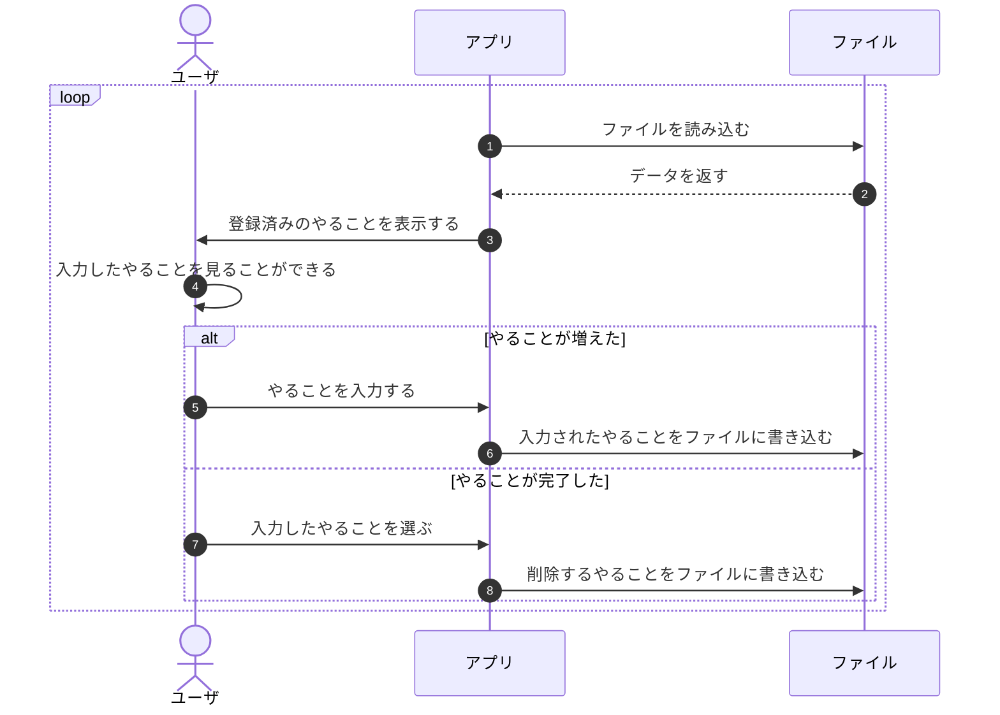

# 🈖️ ファイルを使おう

では、どうすればデータの管理をファイルに任せることができるでしょうか？
"登録"という言葉があるところが、やることデータを管理しているところですね。
前の図では

①登録済みのやることを表示する  
④入力されたやることを登録する  
⑥登録済みのやることを削除する  

が該当します。ここをファイルに任せればいいのです。



まず、①②でファイルに保存したやることを読み込みます。  
次に、⑥⑧でファイルに入力されたやることを書き込みましょう。

あとは読み込み・書き込みの処理をどうやって書くのか？
ということを調べれば十分ですね。

コードに書いていきましょう。

---

## ファイルに書き込む

処理の順番は読み込み➡書き込みですが、ないものを読み込めません。[^1]
なので、書き込みから始めましょう。

[^1]: ファイルを作ってもいいです。ただ、どう保存するかわかっている必要があります。

『java ファイル 書き込み』で調べるといろいろ出てきて困ったと思います。
正解も不正解もないですが、現在は下に示す`java.nio.file.Files`が一番簡単に書けると思います。

/// admonition | サンプルコード

```java title="FirstApp.java"
import java.nio.charset.StandardCharsets;
import java.nio.file.Files;
import java.nio.file.Path;
import java.nio.file.Paths;
import java.nio.file.StandardOpenOption;

public class FirstApp {

  // main メソッドは省略しています

  static final String FILE_PATH = "todo-list.txt";

  public static void save(List<String> todoList) throws IOException {
    Path path = Paths.get(FILE_PATH);

    Files.write(path, todoList,
        StandardCharsets.UTF_8,
        StandardOpenOption.WRITE, StandardOpenOption.TRUNCATE_EXISTING, StandardOpenOption.CREATE);
  }
}
```

///

/// admonition | 文字コード UTF-8
ファイルや次に出てくるデータベースを扱う上で、データがへんな感じになったら大体こいつのせいです。
ちょうどいいくらいの解説をしているサイトがみつからなかったので、自分で調べましょう。
///

/// admonition | StandardOpenOption
[StandardOpenOptionの説明](https://docs.oracle.com/javase/jp/8/docs/api/java/nio/file/StandardOpenOption.html)
を読んでもわからないものはわからないと思うので挙動を試してみましょう
///

ファイルの保存メソッドを使ってmainメソッドを書き換えます。

/// admonition | サンプルコード

```java title="FirstApp.java" hl_lines="21 26"
  public static void main(String[] args) throws IOException {
    AnsiConsole.systemInstall();

    System.out.println("📝 Welcome Back, My To-Do!");

    List<String> todoList = new ArrayList<>();

    final String MENU_ADD = "➕ やることが増えた";

    for (;;) {
      List<String> menu = new ArrayList<>();
      menu.addAll(todoList);
      menu.add(MENU_ADD);

      int index = MyPrompt.select("あなたのやることリスト", menu);
      var todo = menu.get(index);

      if (todo == MENU_ADD) {
        String newToDo = MyPrompt.input("やることを入力してください >");
        todoList.add(newToDo);
        save(todoList);

      } else if (MyPrompt.confirm("「" + todo + "」は完了しましたか？",
          ConfirmChoice.ConfirmationValue.YES) == ConfirmChoice.ConfirmationValue.YES) {
        todoList.remove(index);
        save(todoList);
      }
    }
  }
```

///

/// admonition | 相対パスと絶対パス
ファイルはどこにできましたか？サンプルコードのようにパスを書いた人はソースコードがあるフォルダにできたのではないでしょうか。
詳しい解説は[絶対パスと相対パスの違いは？メリット・デメリット、使い分け方を解説](https://and-engineer.com/articles/Y1fGpxAAAAt07ZlQ)
もう知っておくべきは`.(dot)`が現在のディレクトリ、`..(dot dot)`が一つうえのディレクトリを示すということです。
少しパスを変えて遊んでみましょう。
///

ファイルの操作を調べるのは手こずったかもしれません。
でも、処理はとても簡単でしたね。

## ファイルから読み込む

『java ファイル 読み込み』で調べるといろいろ出てきて困ったと思います。
正解も不正解もないですが、現在は下に示す`java.nio.file.Files`が一番簡単に書けると思います。

<figure markdown>
  { width="480" }
</figure>

/// admonition | サンプルコード

```java title="FirstApp.java"

public class FirstApp {

  // main メソッドは省略しています

  static final String FILE_PATH = "todo-list.txt";

  public static List<String> load() throws IOException {
    Path path = Paths.get(FILE_PATH);
    if (Files.notExists(path)) {
      return new ArrayList<>();
    }

    return Files.readAllLines(path, StandardCharsets.UTF_8);
  }
}
```

///

ファイルがないときに`Files#readAllLines`を実行すると
`java.nio.file.NoSuchFileException`が発生するため、
ファイルがなかったら空のListを返すようにしています。

ファイルの読み込みメソッドを使ってmainメソッドを書き換えます。

/// admonition | サンプルコード

```java title="FirstApp.java" hl_lines="6"
  public static void main(String[] args) throws IOException {
    AnsiConsole.systemInstall();

    System.out.println("📝 Welcome Back, My To-Do!");

    List<String> todoList = load();

    final String MENU_ADD = "➕ やることが増えた";

    for (;;) {
      List<String> menu = new ArrayList<>();
      menu.addAll(todoList);
      menu.add(MENU_ADD);

      int index = MyPrompt.select("あなたのやることリスト", menu);
      var todo = menu.get(index);

      if (todo == MENU_ADD) {
        String newToDo = MyPrompt.input("やることを入力してください >");
        todoList.add(newToDo);
        save(todoList);

      } else if (MyPrompt.confirm("「" + todo + "」は完了しましたか？",
          ConfirmChoice.ConfirmationValue.YES) == ConfirmChoice.ConfirmationValue.YES) {
        todoList.remove(index);
        save(todoList);
      }
    }
  }
```

///

アプリを停止してもToDoはなくなりません。
かなりいい感じになったのではないでしょうか？
