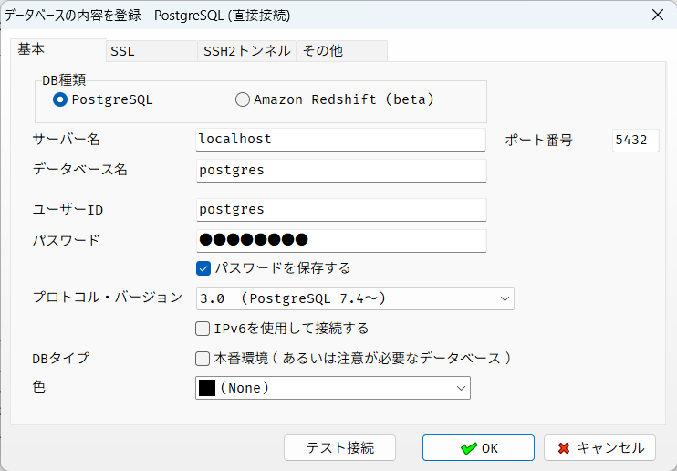
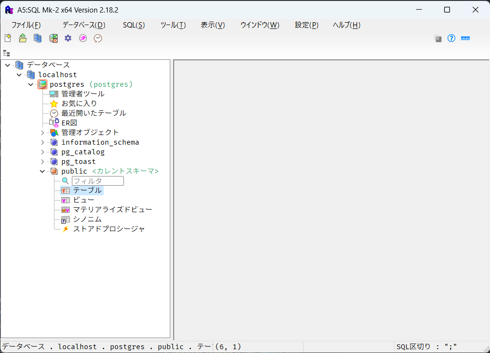
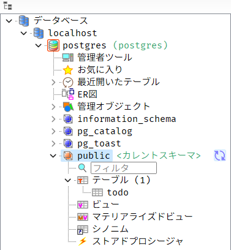

# データベースを試そう

## はじめに

### データベースとは？

データを保存できるシステムです。
ウェブシステムでの役割は、データの保存場所になります。
ファイルと同じですね。ファイルとの機能の違いはなんでしょうか？
ファイルに ToDo を操作したことを思い出してください。

|                                  | ファイル | データベース |
| -------------------------------- | -------- | ------------ |
| 同時編集                         | できない | できる       |
| 特定の行のみの読み込み・書き込み | できない | できる       |

### データって何？

表形式のデータを保存できる。

/// admonition | RDB と NoSQL
///

### 表形式のデータ？

[RDB（リレーショナルデータベース）とは](https://business.ntt-east.co.jp/content/cloudsolution/column-338.html)

### 種類は？

- MySQL
- PostgreSQL
- SQLite

## 実行環境の構築

PostgreSQL を使う。

[プロジェクトを作ろう]のときと同じように、

1. GitHubの[playground-todo](https://github.com/oktntko/playground-todo) をブラウザで表示する.
2. `.(ドット)`を入力する.
3. `todo-docker`を右クリックして Download ボタンをクリックする.
4. エクスプローラーのアドレスバーに `\\wsl.localhost\Ubuntu\home\%USERNAME%\my-todo` を入力する.

```bash title="Windows Terminal"
❯ cd ~/my-todo/todo-docker # ダウンロードした`todo-docker`ディレクトリに移動する
❯ docker compose up --detach
```

- A5M2(Windowsアプリ)を起動する
- データベースの追加と削除 ＞ 追加 ＞ PostgreSQL
- 基本タブ
  - デフォルトからの変更箇所は２つ
    - ①パスワードに`postgres`を入力する
    - ②"パスワードを保存する"に✅を入れる）
  - { width="320" }
- データベース別名 ＞ `localhost/postgres` ＞ OK ＞ 閉じる
- 左側のエクスプローラーから`localhost/postgres`を選ぶ
- そのまま接続
  - { width="320" }
- ++ctrl+n++で"新規ドキュメント" ＞ SQL を選ぶ
- 表示されたエディタに  
```sql title="Query"
CREATE TABLE IF NOT EXISTS todo(
  yarukoto VARCHAR (100)
  , kizitu DATE
);
```
を入力する
- ++ctrl+home++でカーソルを先頭に戻す
- ++ctrl+enter++でSQLを実行する
- "スキーマを再読み込み"をクリックする
  - { width="320" }
- 完成！🎉

## データベースの操作の基本

まず、データベースの操作をするにあたって新米エンジニアが覚えることは次の二つです。

- ツールの使い方（今回はA5M2）
- SQLの読み方・書き方

SQLは、データベースを操作することができる言語です。

Java を書いても実行環境がなければ動かせないのと同じように、
SQL を書いても実行環境がなければデータベースを操作することができません。

そこで、ツールの力を借ります。
[実行環境の構築]の準備でやった操作が基本になります。

- A5M2(Windowsアプリ)を起動する
- 左側のエクスプローラーから`localhost/postgres`を選ぶ
- そのまま接続
  - { width="320" }
- ++ctrl+n++で"新規ドキュメント" ＞ SQL を選ぶ
- 表示されたエディタにSQLを入力する
- ++ctrl+enter++でSQLを実行する

すべてを説明することはできないので、習うより慣れろ、**とにかく動かそう**

これからSQLの操作を説明します。SQLを書いたら同じやり方でSQLを実行してください。

### テーブルの作り方

実は、[実行環境の構築]の最中にテーブルを作っています。

```sql title="Query"
CREATE TABLE IF NOT EXISTS todo(
  yarukoto VARCHAR (100)
  , kizitu DATE
);
```

テーブルとは何でしょうか？
**表形式のデータ**のことです。

このテーブルは、ToDoアプリで管理しているToDoクラスを保存できるよう、
`yarukoto`と`kizitu`の二つの**カラム**(＝列のこと。`column`)を持っています。

`VARCHAR (100)`と`DATE`はなんでしょうか？
Java と同じように、データベースも**データ型**の概念があります。
`VARCHAR`は文字列、`DATE`はそのまま日付のデータになります。

Java のクラスと同じです。

```java title="ToDo.java"
package playground.todo;

import java.time.LocalDate;

public record ToDo(String yarukoto, LocalDate kizitu) {
}
```

[2.3. 新しいテーブルの作成](https://www.postgresql.jp/document/15/html/tutorial-table.html)

### テーブルにデータを追加しよう

```sql title="Query"
INSERT
INTO todo(yarukoto, kizitu)
VALUES ('電話をかける', '2023-04-01');

INSERT
INTO todo(yarukoto, kizitu)
VALUES ('カレンダーを見る', '2023-04-02');

INSERT
INTO todo(yarukoto, kizitu)
VALUES ('テレビを見る', '2023-04-03');
```

[2.4. テーブルに行を挿入](https://www.postgresql.jp/document/15/html/tutorial-populate.html)

### テーブルのデータを確認しよう

```sql title="Query"
SELECT
    *
FROM
  todo;

-- SELECT 句
SELECT
    yarukoto
  , kizitu
FROM
  todo;

-- WHERE 句 （文字列）
SELECT
    yarukoto
  , kizitu
FROM
  todo
WHERE
  yarukoto = '電話をかける';

-- WHERE 句 （日付）
SELECT
    yarukoto
  , kizitu
FROM
  todo
WHERE
  kizitu <= '2023-04-02';

SELECT
    yarukoto
  , kizitu
FROM
  todo
WHERE
  kizitu <= '2023-04-01';

-- ORDER BY 句
SELECT
    yarukoto
  , kizitu
FROM
  todo
ORDER BY
  kizitu ASC;

```

[2.5. テーブルへの問い合わせ](https://www.postgresql.jp/document/15/html/tutorial-select.html)

### テーブルのデータを更新しよう

```sql title="Query"
UPDATE todo
SET
  kizitu = '2023-04-01';

SELECT * FROM todo;

UPDATE todo
SET
  yarukoto = '';

SELECT * FROM todo;

-- ALTER TABLE
ALTER TABLE todo ADD COLUMN id serial;
SELECT * FROM todo;

ALTER TABLE todo DROP COLUMN id serial;
SELECT * FROM todo;

ALTER TABLE todo DROP COLUMN id serial;
ALTER TABLE todo ADD CONSTRAINT pkey_todo_id PRIMARY KEY (id);
SELECT * FROM todo;

-- 順番が気持ち悪いので削除する
DROP TABLE IF EXISTS todo;

CREATE TABLE IF NOT EXISTS todo(
  id serial PRIMARY KEY
  , yarukoto VARCHAR (100)
  , datetime TIMESTAMP WITH TIME ZONE
);

SELECT
    id
  , yarukoto
  , datetime
FROM
  todo;

-- x02_INSERT.sql を再度実行する

-- WHERE 句 & RETURNING 句
UPDATE todo
SET
  yarukoto = '電話をかけなおす'
WHERE
  id = 1 RETURNING *;

UPDATE todo
SET
  kizitu = '2023-04-01'
WHERE
  kizitu > '2023-04-02' RETURNING *;


```

[2.8. 更新](https://www.postgresql.jp/document/15/html/tutorial-update.html)

### テーブルのデータを削除しよう

```sql title="Query"
DELETE
FROM
  todo
WHERE
  id = 1;

```

[2.9. 削除](https://www.postgresql.jp/document/15/html/tutorial-delete.html)

### まとめ

データベースの操作は大きく分けて２つある

1. テーブルを操作する
2. データを操作する

"データを操作する"の基本は４つ

1. データの追加 `INSERT`
2. データの検索 `SELECT`
3. データの更新 `UPDATE`
4. データの削除 `DELETE`

```sql title="Query"
CREATE TABLE IF NOT EXISTS todo( 
  id serial PRIMARY KEY
  , yarukoto VARCHAR (100)
  , kizitu DATE
);
```

## プログラムからデータベースを操作する

次に、プログラム(Java)からデータベースを操作する方法を知りましょう。

素の Java ではデータベースを操作することができません。
**Java がデータベースを操作するためには、 JDBCドライバが必要**です。

JDBC ドライバは他のOSSと同様に`build.gradle`ファイルに追記します。

```kotlin title="build.gradle.kts" hl_lines="6-7"
dependencies {
    // https://mvnrepository.com/artifact/org.fusesource.jansi/jansi
    implementation("org.fusesource.jansi:jansi:2.4.0")
    // https://mvnrepository.com/artifact/de.codeshelf.consoleui/consoleui
    implementation("de.codeshelf.consoleui:consoleui:0.0.13")
    // https://mvnrepository.com/artifact/org.postgresql/postgresql
    implementation("org.postgresql:postgresql:42.6.0")
}
```

追加したらいったんクリーンアップ(Clean Workspace)しましょう。

{ width="480" }

/// admonition | サンプルコード

```java title="TryDatabase.java"
package playground.todo;

import java.io.IOException;
import java.sql.Connection;
import java.sql.Date;
import java.sql.DriverManager;
import java.sql.PreparedStatement;
import java.sql.ResultSet;
import java.sql.SQLException;
import java.sql.Statement;
import java.time.LocalDate;

public class TryDatabase {

  private static final String URL = "jdbc:postgresql://localhost:5432/postgres";
  private static final String USER = "postgres";
  private static final String PASS = "postgres";

  public static void main(String[] args) throws IOException, SQLException {
    select();

    var id1 = insert("yarukoto1", LocalDate.of(2022, 1, 1));
    var id2 = insert("yarukoto2", LocalDate.of(2022, 2, 1));
    var id3 = insert("yarukoto3", LocalDate.of(2022, 2, 2));

    select();

    update("yarukoto1UPDATE", LocalDate.of(2023, 1, 1), id1);
    update("yarukoto2UPDATE", LocalDate.of(2023, 2, 1), id2);
    update("yarukoto3UPDATE", LocalDate.of(2023, 2, 2), id3);

    select();

    delete(id1);
    delete(id2);
    delete(id3);

    select();
  }

  public static void select()
      throws IOException, SQLException {
    System.out.println("start SELECT");
    try (Connection conn = DriverManager.getConnection(URL, USER, PASS);
        PreparedStatement ps = conn.prepareStatement("""
            SELECT
              id
              , yarukoto
              , kizitu
            FROM
              todo; """);
        ResultSet rs = ps.executeQuery()) {

      while (rs.next()) {
        var id = rs.getInt("id");
        var yarukoto = rs.getString("yarukoto");
        var kizitu = rs.getDate("kizitu");

        System.out.println("id=" + id + ", yarukoto=" + yarukoto + ", kizitu=" + kizitu);
      }
    }
  }

  public static int insert(String yarukoto, LocalDate kizitu)
      throws IOException, SQLException {
    System.out.println("start INSERT");
    try (Connection conn = DriverManager.getConnection(URL, USER, PASS);
        PreparedStatement ps = conn.prepareStatement("""
            INSERT INTO todo (
                yarukoto
              , kizitu
            ) VALUES (
                ? -- parameterIndex = 1
              , ? -- parameterIndex = 2
            ); """, Statement.RETURN_GENERATED_KEYS)) {
      ps.setString(1, yarukoto);
      ps.setDate(2, Date.valueOf(kizitu));

      int count = ps.executeUpdate();
      System.out.println("updated count=" + count);

      ResultSet rs = ps.getGeneratedKeys();
      if (rs.next()) {
        int id = rs.getInt("id");
        return id;
      } else {
        throw new RuntimeException("Failed to execute INSERT INTO todo.");
      }
    }
  }

  public static int update(String yarukoto, LocalDate kizitu, int id)
      throws IOException, SQLException {
    System.out.println("start UPDATE");
    try (Connection conn = DriverManager.getConnection(URL, USER, PASS);
        PreparedStatement ps = conn.prepareStatement("""
            UPDATE todo
            SET
                yarukoto = ? -- parameterIndex = 1
              , kizitu = ?   -- parameterIndex = 2
            WHERE
              id = ?         -- parameterIndex = 3; """)) {
      ps.setString(1, yarukoto);
      ps.setDate(2, Date.valueOf(kizitu));
      ps.setInt(3, id);

      int count = ps.executeUpdate();
      System.out.println("updated count=" + count);

      return count;
    }
  }

  public static int delete(int id)
      throws IOException, SQLException {
    System.out.println("start DELETE");
    try (Connection conn = DriverManager.getConnection(URL, USER, PASS);
        PreparedStatement ps = conn.prepareStatement("""
            DELETE FROM todo
            WHERE
              id = ?         -- parameterIndex = 1; """)) {
      ps.setInt(1, id);

      int count = ps.executeUpdate();
      System.out.println("updated count=" + count);

      return count;
    }
  }
}
```

///

SELECT, INSERT, UPDATE, DELETE と、それを実行するためのサンプルコードです。

サンプルコードの解説をします。

### データベースに接続する

SELECT, INSERT, UPDATE, DELETEのすべてのコードに共通するのは次の個所です。

どのデータベースに、どのユーザで接続するか？を指定しています。
得られた`Connection`オブジェクトを使うことで指定したデータベースを操作することができます。

A5M2から操作するときも、まず初めにデータベースに接続していますよね。
それと同じです。

```java title="TryDatabase.java"
  private static final String URL = "jdbc:postgresql://localhost:5432/postgres";
  private static final String USER = "postgres";
  private static final String PASS = "postgres";

    try (Connection conn = DriverManager.getConnection(URL, USER, PASS);
```

/// admonition | try-with-resources
`Closable`なクラスを使うときはtry-with-resources を使いましょう。
[try-with-resources文の基本](https://qiita.com/Takmiy/items/a0f65c58b407dbc0ca99)
///

### SQL文をつくる (`PreparedStatement`)

SELECT, INSERT, UPDATE, DELETEのすべてのコードに共通するのは次の個所です。

```java title="TryDatabase.java(select)"
        PreparedStatement ps = conn.prepareStatement("""
            SELECT
              id
              , yarukoto
              , kizitu
            FROM
              todo; """);
```

`Connection`にSQL(文字列)を渡して`PreparedStatement`にしています。
Java で SQL を実行するために、文字列の状態では実行できないからです。

/// admonition | Text Blocks
Text Blocksを使うと、文字列を複数行で書くことができる。

```java
"""
ここから
中身
ここまで"""
```

///

INSERT, UPDATE, DELETE の例も見てみましょう。

/// admonition | Text Blocks

```java title="TryDatabase.java(insert)"
        PreparedStatement ps = conn.prepareStatement("""
            INSERT INTO todo (
                yarukoto
              , kizitu
            ) VALUES (
                ? -- parameterIndex = 1
              , ? -- parameterIndex = 2
            ); """, Statement.RETURN_GENERATED_KEYS)) {
```

```java title="TryDatabase.java(update)"
        PreparedStatement ps = conn.prepareStatement("""
            UPDATE todo
            SET
                yarukoto = ? -- parameterIndex = 1
              , kizitu = ?   -- parameterIndex = 2
            WHERE
              id = ?         -- parameterIndex = 3; """)) {
```

```java title="TryDatabase.java(delete)"
        PreparedStatement ps = conn.prepareStatement("""
            DELETE FROM todo
            WHERE
              id = ?         -- parameterIndex = 1; """)) {
```

///

SQL文は分かりますが、`?(はてな)`がついています。
これはなんでしょうか？

/// admonition | SQLのコメント
    type: tip

```sql
-- １行コメント
/*
ブロックコメント
*/
```

///

### SQL文にパラメータをセットする

`?(はてな)`の正体はパラメータです。

プログラムからSQLを実行する場合、事前に登録する値を決められません。
そこで、プログラムから実行するときに値を設定できるように、パラメータ`?(はてな)`を使います。

では、どうやってパラメータをセットするのか？
UPDATEの例を見てみましょう。

```java title="TryDatabase.java(update)"
        PreparedStatement ps = conn.prepareStatement("""
            UPDATE todo
            SET
                yarukoto = ? -- parameterIndex = 1
              , kizitu = ?   -- parameterIndex = 2
            WHERE
              id = ?         -- parameterIndex = 3; """)) {
      ps.setString(1, yarukoto);
      ps.setDate(2, Date.valueOf(kizitu));
      ps.setInt(3, id);
```

`PreparedStatement`クラスには、`set+データ型`のメソッドが用意されています。
引数は、**`?(はてな)`の番号**と**セットする値**の二つです。
使い方は例を見れば一目瞭然です。

/// admonition | parameterIndex
    type: tip

じゃあパラメータが100個あったらいちいち数えるのか？
ミスったら全部やり直し？
しかもWHERE句とSELECT句で分かれてないのかよ。
ということまで想像できたらすごい。
実際の現場では、**`PreparedStatement`を使ってデータベースを操作することはない**と思います。
データベースを操作するためのライブラリ/フレームワークがたくさんあります。
///

### SQLを実行する

SELECT と INSERT/UPDATE/DELETE で実行方法が違います。

SELECT は`PreparedStatement#executeQuery`で実行します。

```java title="TryDatabase.java(select)"
        ResultSet rs = ps.executeQuery()) {
```

INSERT/UPDATE/DELETE は`PreparedStatement#executeUpdate`で実行します。

```java title="TryDatabase.java(insert/update/delete)"
      int count = ps.executeUpdate();
```

２つの違いはなんでしょうか？

戻り値ですね。 SELECT は`ResultSet`、 INSERT/UPDATE/DELETE は`int`です。

そもそもSQLのとして、SELECTの結果は**該当する行の情報**、
INSERT/UPDATE/DELETEの結果は**影響を受けた行数**です。

Java に限った話ではなく、 SELECT と INSERT/UPDATE/DELETE で実行結果が違います。
A5M2でも、 SELECT を実行すると、行の情報が画面下部に表示され、
INSERT/UPDATE/DELETE を実行すると、影響を受けた行数がコンソールに表示されますね。

### SQLの実行結果を受け取る

SELECT では、 ResultSet に取得した行の情報が入っています。

ResultSet はまず`List`のような特徴を持ちます。
`while`文で取得した１行ずつを繰り返し処理します。

```java
      while (rs.next()) {
```

そして`Map`のような特徴を持ちます。
`ge+データ型`のメソッドが用意されています。引数は**列名**になります。

```java
        var id = rs.getInt("id");
        var yarukoto = rs.getString("yarukoto");
        var kizitu = rs.getDate("kizitu");
```

INSERT/UPDATE/DELETE では、影響を受けた行数が実行結果になるので、そのまま`int`の戻り値がすべてです。

/// admonition | INSERT してできたレコードのID
INSERT してできたレコードのIDがほしいという場面があるでしょう。
いろいろ方法はあるみたいですが、

- `PreparedStatement` に `Statement.RETURN_GENERATED_KEYS` を渡す
- `PreparedStatement#getGeneratedKeys` でデータを受け取る

方法が可もなく不可もなくって感じだったのでそうしました。
///

### まとめ

1. データベースに接続する(`Connection`)
2. SQL文を作る(`PreparedStatement`)
3. SQLにパラメータをセットする(`PreparedStatement#setXXX`)
4. SQLを実行する(`PreparedStatement#executeQuery` / `PreparedStatement#executeUpdate`)
5. 実行結果を受け取る(`ResultSet#getXXX`)
