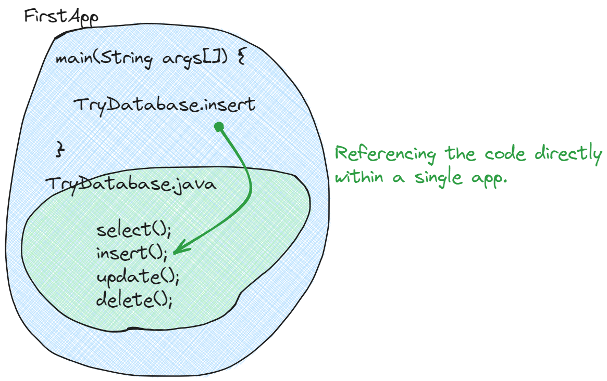
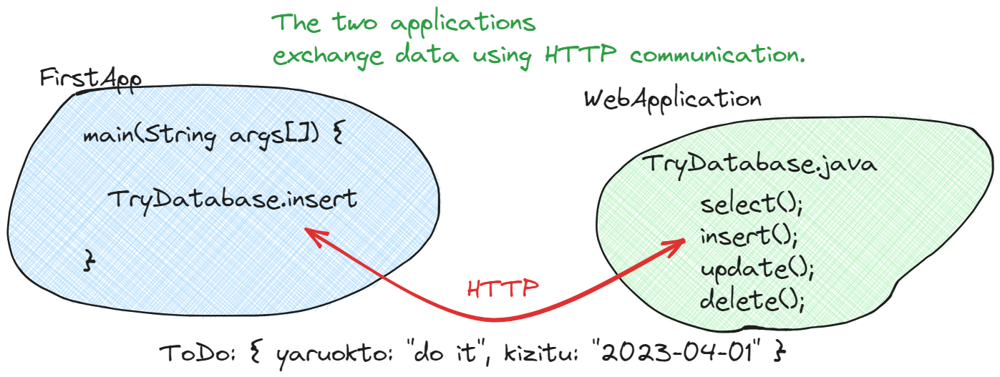
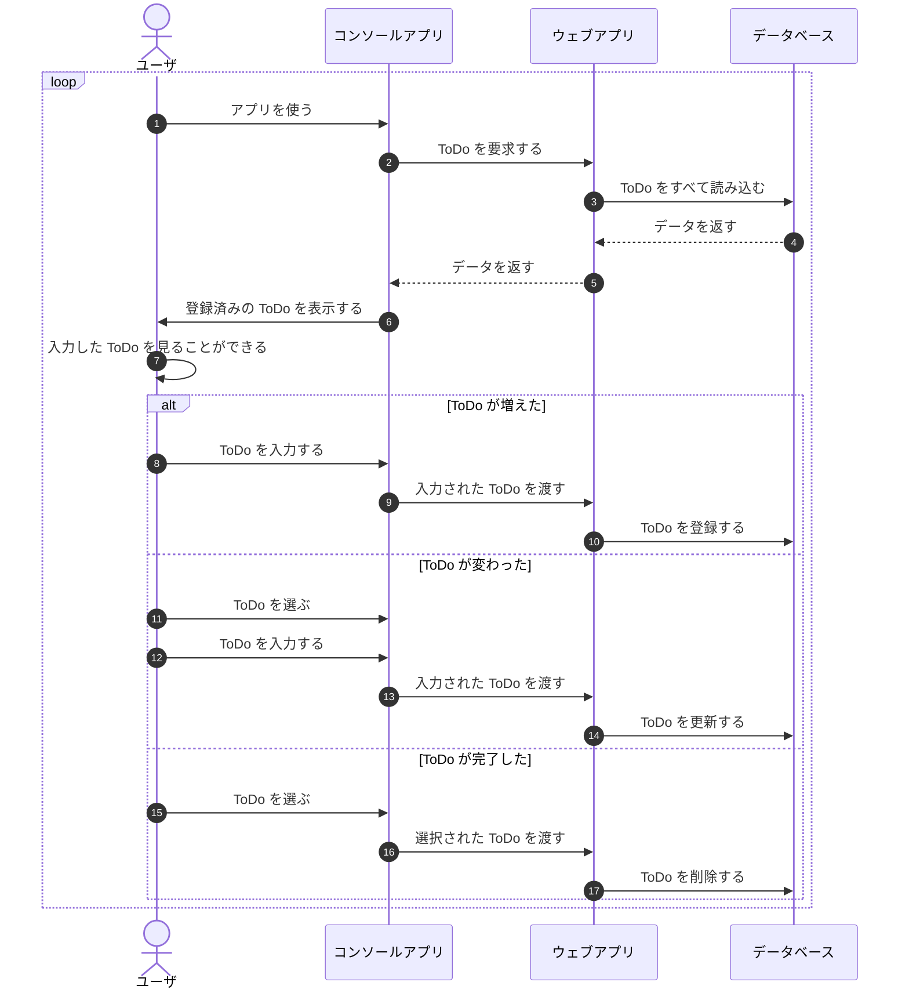

# SpringBoot を試そう

データベースを使えば、ウェブシステム化できたといえるのでしょうか？

できていません。

- ウェブシステム化すると、同時に多数の人がデータを操作する
- ファイルでは同時に多数の人がデータを操作することができない
- 同時に多数の人がデータを操作することができるのはデータベース

だからファイルからデータベースを使うようにしました。

ウェブシステムとは何でしょうか？
どうすればウェブシステム化できたといえるでしょうか？

ウェブシステムは、インターネットを介して利用できるシステムのことです。

インターネットを介してシステムを利用できるようにするにはどうすればいいでしょうか？

簡単に言うと、インターネットを介して通信を行う際のルールに従う必要があります。
そのルールかつ手段が、`HTTP`です。ウェブページのURLに必ずついていますね。
`HTTP`のルールに従って`HTTP`を使って通信することで、インターネットを介してシステムを利用できるようになります。

つまり、どうすればいいか？

現状、

コンソールに入力してコンソールに出力する

という状態です。そこから、

HTTPに入力してHTTPに出力する

状態にします。これでウェブシステム化ができます。

**HTTPに入力**を**リクエスト**、**HTTPに出力**を**レスポンス**といいます。

## SpringBootを使う

### パッケージを入れる

```kotlin title="build.gradle.kts" hl_lines="4-6 25-29 37-40"
plugins {
    // Apply the application plugin to add support for building a CLI application in Java.
    application
    java
    id("org.springframework.boot") version "3.1.0"
    id("io.spring.dependency-management") version "1.1.0"
}

group = "playground.todo"
version = "0.0.1-SNAPSHOT"
java.sourceCompatibility = JavaVersion.VERSION_17

repositories {
    // Use Maven Central for resolving dependencies.
    mavenCentral()
}

dependencies {
    // https://mvnrepository.com/artifact/org.fusesource.jansi/jansi
    implementation("org.fusesource.jansi:jansi:2.4.0")
    // https://mvnrepository.com/artifact/de.codeshelf.consoleui/consoleui
    implementation("de.codeshelf.consoleui:consoleui:0.0.13")
    // https://mvnrepository.com/artifact/org.postgresql/postgresql
    implementation("org.postgresql:postgresql:42.6.0")
    // https://mvnrepository.com/artifact/com.konghq/unirest-java
    implementation("com.konghq:unirest-java:3.14.2")

    implementation("org.springframework.boot:spring-boot-starter-web")
    testImplementation("org.springframework.boot:spring-boot-starter-test")
}

application {
    // Define the main class for the application.
    mainClass.set("playground.todo.FirstApp")
}

tasks.withType<Test> {
    useJUnitPlatform()
}

```

/// admonition | エラーが出るけど動く

```sh
The supplied phased action failed with an exception.
A problem occurred configuring root project 'todo-app'.
Could not resolve all files for configuration ':classpath'.
Could not resolve org.springframework.boot:spring-boot-gradle-plugin:3.1.0.
```

///

### ログが出るようにする

`src/main/resources` に

- application.yml
- logback-spring.xml
を追加する

↓だけでもログは出るけど。

```yaml title="application.yml"
logging:
  level:
    org.springframework.web: "debug"
```

↓も追加する。

```xml title="logback-spring.xml"
<?xml version="1.0" encoding="UTF-8"?>
<configuration>
    <include resource="org/springframework/boot/logging/logback/defaults.xml"/>
    <include resource="org/springframework/boot/logging/logback/console-appender.xml" />
    <root level="INFO">
        <appender-ref ref="CONSOLE" />
    </root>
    <logger name="org.springframework.web" level="DEBUG"/>
</configuration>
```

### SpringBoot のエントリポイントを追加する

```java title="WebApplication.java"
package playground.todo;

import org.springframework.boot.SpringApplication;
import org.springframework.boot.autoconfigure.SpringBootApplication;

@SpringBootApplication
public class WebApplication {
  public static void main(String[] args) {
    SpringApplication.run(WebApplication.class, args);
  }
}
```

`public static void main(String[] args) {`の上に表示される**Run**でエラーなく実行できたら成功

### API のエンドポイントを追加する

```java title="TryDatabase.java"
@RestController
public class TryDatabase {

  // curl "http://localhost:8080/api/todo" | jq .
  @GetMapping(path = "/api/todo")
  public static List<ToDo> select()
      throws IOException, SQLException {
        ///
  }

  // curl "http://localhost:8080/api/todo" \
  // --request POST --header "Content-Type: application/json" \
  // --data '{"yarukoto": "yarukoto", "kizitu": "2023-04-01"}'
  @PostMapping(path = "/api/todo")
  public static int insert(@RequestBody ToDo todo)
      throws IOException, SQLException {
        ///
  }

  // curl "http://localhost:8080/api/todo/[xx]" \
  // --request PUT --header "Content-Type: application/json" \
  // --data '{"yarukoto": "yarukoto2", "kizitu": "2023-05-01"}'
  @PutMapping(path = "/api/todo/{id}")
  public static int update(@PathVariable("id") int id, @RequestBody ToDo todo)
      throws IOException, SQLException {
        ///
  }

  // curl "http://localhost:8080/api/todo/[xx]" \
  // --request DELETE
  @DeleteMapping(path = "/api/todo/{id}")
  public static int delete(@PathVariable("id") int id)
      throws IOException, SQLException {
        ///
  }
}
```

curlコマンドを実行してレスポンスが表示されたり、データが表示されたらOK

### 何が変わったの？

今まで作っていたコンソールアプリ からすると、何も変わっていません。
今まで通り使えます。

何が変わったのか？

`http://localhost:8080/api/todo` をブラウザのアドレスバーに入力してみましょう。
JSONテキストが表示されたはずです。

ウェブアプリっぽくなってきました。

では、次のように書き換えて、アプリを再起動しましょう。
そして、`http://localhost:8080/api/todo` をブラウザのアドレスバーに入力してみましょう。

```java
  @GetMapping(path = "/api/todo")
  public static List<ToDo> select()
      throws IOException, SQLException {
        ///

    return "Hello World!";
  }
```

<p style="font-size: 24px; text-align: center; font-weight: bold;">ウェ、ウェブアプリっぽい...</p>

### コンソールアプリからコードを直接実行せずにコードを実行しよう

何が変わったのか？に触れていませんでした。

今は SpringBoot がウェブアプリとして立ち上がっただけで、
今まで作っていた ToDoアプリ は何も変わっていません。

<figure markdown>
  <figcaption>single app!</figcaption>
  { width="640" }
</figure>

```java title="FirstApp.java"
    List<ToDo> todoList = TryDatabase.select();

    ///

        ToDo newToDo = MyPrompt.form("", "");
        int id = TryDatabase.insert(newToDo);

        ///

        ToDo newToDo = MyPrompt.form(todo.yarukoto(), LocalDateUtils.toString(todo.kizitu()));
        TryDatabase.update(todo.id(), newToDo);

        ///

        TryDatabase.delete(todo.id());
```

どうすればいいか？

HTTP通信を行います。二つのアプリに架け橋をかけましょう。

<figure markdown>
  <figcaption>two apps!</figcaption>
  { width="640" }
</figure>

Unirest は curlコマンドと似ていますね。

```diff title="FirstApp.java"
-   List<ToDo> todoList = TryDatabase.select();
+   List<ToDo> todoList = Unirest.get(BASE_URL + "/api/todo")
+       .asObject(new GenericType<List<ToDo>>() {
+       })
+       .getBody();

    ///

        ToDo newToDo = MyPrompt.form("", "");
-       int id = TryDatabase.insert(newToDo);
+       var res = Unirest.post(BASE_URL + "/api/todo")
+           .header("Content-Type", "application/json")
+           .body(newToDo)
+           .asString();
+       int id = Integer.valueOf(res.getBody());

        ///

        ToDo newToDo = MyPrompt.form(todo.yarukoto(), LocalDateUtils.toString(todo.kizitu()));
-       TryDatabase.update(todo.id(), newToDo);
+       Unirest.put(BASE_URL + "/api/todo/" + todo.id())
+           .header("Content-Type", "application/json")
+           .body(newToDo)
+           .asJson();

        ///

-       TryDatabase.delete(todo.id());
+       Unirest.delete(BASE_URL + "/api/todo/" + todo.id())
+           .asJson();
```

/// admonition

Unirest はライブラリ

///

### コンソールアプリとウェブアプリを同時に起動してコンソールアプリからウェブアプリを動かしてみる

同時に起動する

コンソールアプリから動かすと、ウェブアプリのログが流れるはず。
データベースのデータも増えたり消えたりするはず。

結果は何も変わりません。
でも、システムの構成が変わりました。
シーケンス図を更新しましょう。



<p style="font-size: 24px; text-align: center; font-weight: bold;">え？複雑になってますやん...</p>

た、確かに。

いやしかし、データベースの特性を思い出してください。

- 同時に編集できる
- 大量のデータを保存・検索できる
- なんかあれば

つまり、データベースを使うということは、一か所に大量のデータを集めて、同時に編集するということです。

データベースが一か所にいてユーザがたくさんいる場合、
コンソールアプリだけでデータベースを操作しようとすると、
**ユーザの手元にあるアプリにデータベースの認証情報や接続情報を公開する**必要があります。

プログラムに書いていない操作でもやりたい放題できてしまいます。
**信頼関係のある間柄の人にしか使ってもらえませんね。**

しかし、ウェブアプリを間に挟めば解決するのです。

ウェブアプリをデータベースと同じ場所に置き、
ウェブアプリにデータベースの認証情報や接続情報を持たせます。
**コンソールアプリには、ウェブアプリのURLだけ設定しておきます。**

つまり、ユーザの手元には公開してもいい情報だけ与えて、秘密の情報は守るのです。
こうすれば、**たくさんの人に使ってもらうことができます。**

さて、コンソールアプリをウェブ画面に差し替えると・・・？

**いよいよToDoアプリが完成します！**
