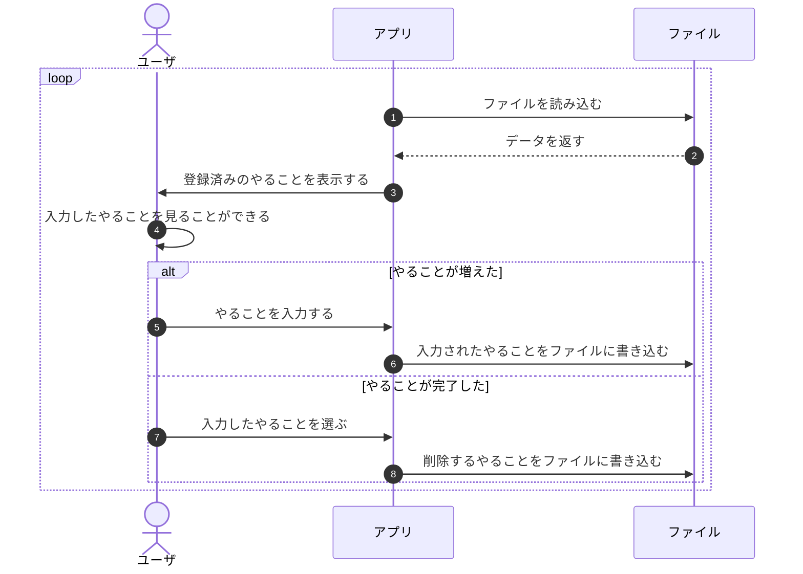

# データベースを使おう

[データベースを試そう]で環境構築ができ、あなたに基礎知識は詰め込みました。
あとは興味を持って深く潜ることです。

ここでは、ToDoを管理する場所を、**ファイルからデータベースに置き換えましょう。**

```mermaid
sequenceDiagram
  autonumber
  actor ユーザ
  participant app as アプリ
  participant storage as ファイル

  loop ;;

    app ->> storage: ファイルを読み込む
    storage -->> app: データを返す
    app ->> ユーザ: 登録済みのやることを表示する
    ユーザ ->> ユーザ: 入力したやることを見ることができる

    alt やることが増えた
      ユーザ ->> app: やることを入力する
      app ->> storage: 入力されたやることをファイルに書き込む

    else やることが完了した
      ユーザ ->> app: 入力したやることを選ぶ
      app ->> storage: 削除するやることをファイルに書き込む

    end
  end
```
