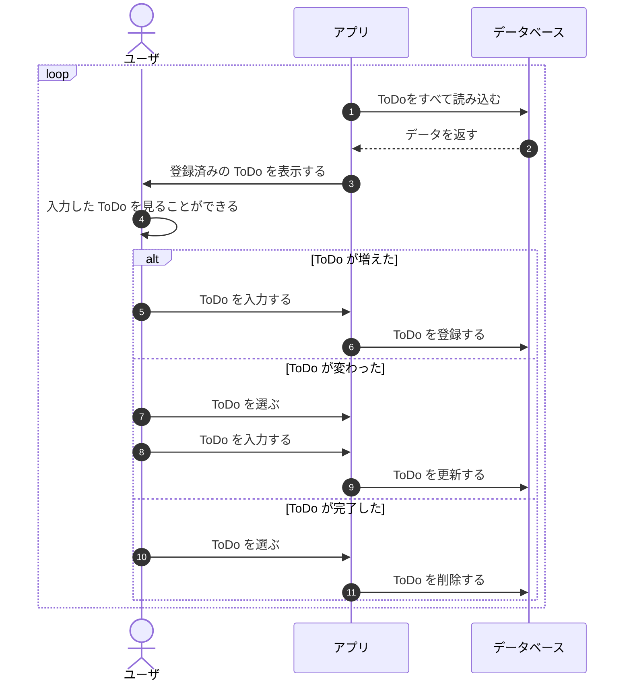

# データベースを使おう

3分でできてしまったという人と、まったくわからなかったという人が分かれ出すのがこのあたりだと思っています。

もともと`ToDo`クラスは`やること`と`期日`しか項目を持っていませんでした。

```java title="ToDo.java"
package playground.todo;

import java.time.LocalDate;

public record ToDo(String yarukoto, LocalDate kizitu) {
}
```

しかし、データベースで操作するためには、IDになるものが必要でした。
データベース上では、`id列`を追加しましたね。

つまり、`ToDo`クラスも`id列`に該当する項目が必要になります。
ということで、項目を追加しましょう。

```java title="ToDo.java"
public record ToDo(Integer id, String yarukoto, LocalDate kizitu) {
}
```

/// admonition | Integer と int
int はプリミティブ型で null になり得ません。
null になるのはオブジェクト型だけです。

今は、ToDoクラスに id を追加したいですね。
しかし、ユーザがやることを入力した時点では id がないので困っています。
データベースに登録して初めて id が生まれるからです。

そんなときに使うのが Integer です。
オブジェクト型なので、 null を代入することができます。

その代わり、 null安全にするための考慮が必要になります。
///

あとは、

1. idの追加に対応するために書き換えていくこと
2. 本題であるファイルからデータベースへの乗り換えを行う

だけです。

## データの読み込みを変える

まずはファイルからデータを取っているところをデータベースから取りましょう。

```diff
-   List<ToDo> todoList = load();
+   List<ToDo> todoList = TryDatabase.select();
```

そのために、`TryDatabase#select`を変える必要があります。
もともとはコンソール出力しかしていませんでしたが、
`List<ToDo>`を返却するようにしましょう。

`ResultSet`はListのような特徴を持つので簡単ですね。

```java title="TryDatabase.java(select)" hl_lines="3 20-21 25"
  public static List<ToDo> select()
      throws IOException, SQLException {
    List<ToDo> list = new ArrayList<>();

    try (Connection conn = DriverManager.getConnection(URL, USER, PASS);
        PreparedStatement ps = conn.prepareStatement("""
            SELECT
              id
              , yarukoto
              , kizitu
            FROM
              todo; """);
        ResultSet rs = ps.executeQuery()) {

      while (rs.next()) {
        var id = rs.getInt("id");
        var yarukoto = rs.getString("yarukoto");
        var kizitu = LocalDateUtils.toLocalDate(rs.getDate("kizitu"));

        ToDo todo = new ToDo(id, yarukoto, kizitu);
        list.add(todo);
      }
    }

    return list;
  }
```

## メニューを変える

`ToDo`クラスに`id`を追加してしまったのでコンパイルエラーになってしまいました。
が、これは以前、期日を追加したときも同じようなことをやりましたね。

```diff title="FirstApp.java"
-   final ToDo MENU_ADD = new ToDo(MENU_LABEL, null);
+   final ToDo MENU_ADD = new ToDo(null, MENU_LABEL, null);
```

## データの保存を変える

### 登録

```java title="FirstApp.java"
      if (todo == MENU_ADD) {
        ToDo newToDo = MyPrompt.form("", "");                              // 1. 入力を受け取る
        int id = TryDatabase.insert(newToDo.yarukoto(), newToDo.kizitu()); // 2. 入力値をデータベースに登録する
        todoList.add(new ToDo(id, newToDo.yarukoto(), newToDo.kizitu()));  // 3. UIに反映する
```

### 更新

```java title="FirstApp.java"
      } else if (MyPrompt.confirm("「" + todo.yarukoto() + "」を変更しますか？",
          ConfirmChoice.ConfirmationValue.YES) == ConfirmChoice.ConfirmationValue.YES) {
        ToDo newToDo = MyPrompt.form(todo.yarukoto(), LocalDateUtils.toString(todo.kizitu())); // 1. 入力を受け取る
        TryDatabase.update(newToDo.yarukoto(), newToDo.kizitu(), todo.id());                   // 2. 入力値をデータベースに登録する
        todoList.set(index, newToDo);                                                          // 3. UIに反映する
```

### 削除

```java title="FirstApp.java"
      } else if (MyPrompt.confirm("「" + todo.yarukoto() + "」は完了しましたか？",
          ConfirmChoice.ConfirmationValue.YES) == ConfirmChoice.ConfirmationValue.YES) { // 1. 入力を受け取る
        TryDatabase.delete(todo.id());                                                   // 2. 入力値をデータベースに登録する
        todoList.remove(index);                                                          // 3. UIに反映する
      }
```

簡単でした。`It's so easy.🎉`

## まとめ


